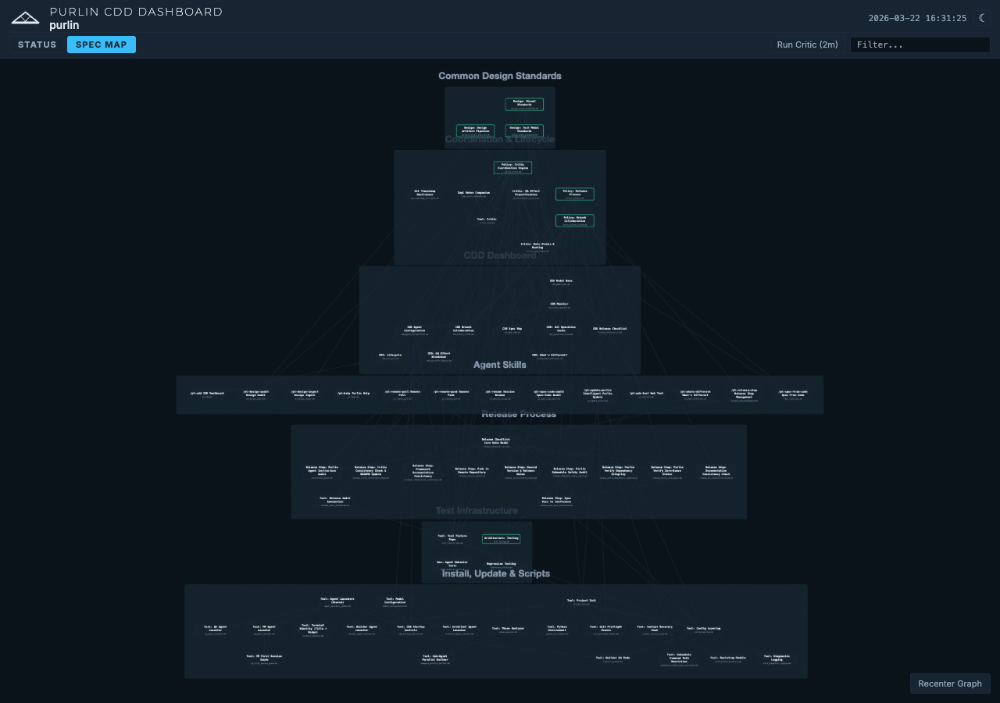

# Spec Map Guide

## Overview

The Spec Map is an interactive dependency graph built into the [CDD Dashboard](status-grid-guide.md).
It visualizes every feature file in `features/` as a node and draws directed
arrows between them to show prerequisite relationships. Features are clustered
into category groups so you can see, at a glance, how work is organized and
where bottlenecks exist.

Use the Spec Map to:

- Understand which features must be completed before others can begin.
- Identify [anchor nodes](critic-and-cdd-guide.md) (architectural, design, and policy foundations).
- Navigate quickly to any feature's detail view.
- Spot isolated features that have no dependencies.

---

## Opening the Spec Map

1. Launch the CDD Dashboard.
2. Click the **Spec Map** tab in the header, or navigate directly to
   `http://localhost:<port>/#map`.

On first load the graph auto-fits to the viewport so every node and category
is visible.



The screenshot above shows a typical project with categories such as "Common
Design Standards", "Coordination & Lifecycle", "CDD Dashboard", "Agent
Skills", "Release Process", "Test Infrastructure", and "Install, Update &
Scripts". Anchor nodes are distinguishable by their green borders.

---

## Reading the Graph

### Feature Nodes

Each feature appears as a rectangular node (220 px wide) containing two lines
of text:

| Line | Style | Content |
|------|-------|---------|
| Top  | 14 px, bold | Friendly feature name |
| Bottom | 9 px, muted | Filename (e.g., `cdd_spec_map.md`) |

Node height varies depending on how the label wraps.

### Anchor Nodes

Anchor nodes represent foundational constraints: architecture decisions,
design standards, and policies. They are identified by a filename prefix of
`arch_`, `design_`, or `policy_`.

Visually, anchor nodes look the same as regular feature nodes except for a
**green border** (3 px, 90% opacity) instead of the default gray border. This
makes them easy to spot as the structural backbone of the project.

### Edges and Arrows

Arrows are directed: they point **from a prerequisite to a dependent
feature**. If feature B lists feature A in its `> Prerequisite:` metadata, an
arrow runs from A to B. Follow the arrows forward to see what a feature
unlocks; follow them backward to see what it depends on.

Edges are non-interactive -- clicks pass through them.

### Category Groups

Features that share the same `> Category:` metadata are collected into a
dashed-border container with a light background. The category label appears
below the container and scales inversely with zoom so it stays readable when
you are zoomed out to an overview level (~0.15x) and does not grow excessively
large when you zoom in.

Categories are arranged using topological layer ordering. Within each
category, features are laid out hierarchically by the dagre algorithm.

---

## Navigating the Map

### Zoom and Pan

- **Scroll wheel or pinch**: zoom in and out (range: 0.1x to 5.0x).
- **Drag the background**: pan across the graph.

### Zoom to Category

**Double-click a category box** to zoom in and fit that category to the
viewport. The transition animates over 400 ms.

### Recenter

- **Double-click the background** to recenter the entire graph.
- **Click the "Recenter Graph" button** in the bottom-right corner to reset
  zoom, pan, and all manually moved node positions.

### Moving Nodes

Drag any feature node to reposition it. The new position is stored in
`localStorage` and survives page reloads.

---

## Exploring Features

### Hover to Highlight Dependencies

Hover over a feature node to highlight its direct neighbors. Prerequisite and
dependent nodes receive an orange border (#FF7043). All non-adjacent nodes are
de-emphasized so the immediate dependency neighborhood stands out.

This is the fastest way to answer "what does this feature depend on?" and
"what depends on this feature?"

### Click to Open Detail Modal

Click a feature node to open its **Feature Detail Modal** (70% of viewport
width). The modal renders the feature's full markdown content along with its
metadata tags. A font-size slider in the modal header lets you adjust
readability without changing the main graph.

### Search to Filter

The shared search box in the dashboard header filters the Spec Map in real
time. Rather than hiding non-matching nodes (which would disrupt spatial
context), the map dims them:

| Element | Matching | Non-matching |
|---------|----------|--------------|
| Nodes | Full opacity | 15% opacity |
| Edges | Full opacity | 8% opacity |
| Category containers | Full opacity | Dimmed only when **all** children are non-matching |

Matching nodes remain fully visible and unchanged so you can still see where
they sit relative to the rest of the graph.

---

## Border Colors at a Glance

| Border Color | Meaning |
|-------------|---------|
| Gray (2 px) | Regular feature node |
| Green (3 px) | Anchor node (`arch_`, `design_`, or `policy_` prefix) |
| Orange (on hover) | Direct neighbor of the currently hovered node |

---

## Auto-Refresh and Themes

The graph refreshes every 5 seconds. If you have manually zoomed or panned,
your view is preserved. If you have not interacted, the graph re-fits to the
viewport. After 5 minutes of inactivity, manual overrides reset automatically.

The Spec Map follows the dashboard's current theme (dark or light). Toggling
the theme regenerates the graph with the new color palette while preserving
your zoom and pan state.

---

## CLI Access

To regenerate the dependency graph data outside of the dashboard:

```
tools/cdd/status.sh --graph
```

This writes the graph to `.purlin/cache/dependency_graph.json`.

---

## Tips and Tricks

- **Find a feature fast.** Type part of its name in the search box. Every
  non-matching node dims, leaving your target clearly visible in its spatial
  context.
- **Drill into a category.** Double-click the category box to zoom in and see
  its internal dependency structure clearly.
- **Reset everything.** Click "Recenter Graph" in the bottom-right corner to
  return to the default overview with all node positions restored.
- **Check upstream risk.** Hover over a feature to see its prerequisites
  highlighted in orange. If an anchor node lights up, that feature depends on
  a foundational constraint.
- **Spot orphans.** Features with no incoming or outgoing arrows have no
  declared dependencies. These are either leaf features or candidates for
  missing prerequisite links.
