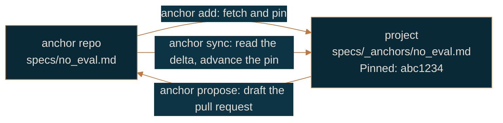

# Specs and anchors

For anyone who writes rules: engineers, PMs, designers and QA.

A spec is one file per feature. It holds the claims the software must satisfy and how each
claim is observed. A **rule** is one claim, one line. A **proof** says how that claim is
observed. A **test** is the executable form of a proof, tagged with its rule. Those three
are the whole model, and everything else Purlin does reads them.

The format is versioned. `references/formats/spec_format.md` inside the plugin is the
contract, at Format-Version 11; this page explains it and that file settles it.

## The file

```
specs/<category>/<name>.md
```

```markdown
# Feature: login

> Description: Email and password sign-in with a lockout after repeated failures.
> Requires: security_baseline
> Scope: src/auth.py, src/session.py
> Stack: python/flask, bcrypt

## Rules

- RULE-1: Return 200 and a session cookie for a correct email and password [risk: high] [origin: pm] [criterion: US-12]
- RULE-2: Return 401 for a wrong password [risk: high] [origin: pm]
- RULE-3: Lock the account for 15 minutes after 5 consecutive failures [risk: medium] [origin: pm]

## Proof

- PROOF-1 (RULE-1): POST /login with a known user; verify 200 and a Set-Cookie header @integration
- PROOF-2 (RULE-2): POST /login with the wrong password; verify 401 and no cookie @integration
- PROOF-3 (RULE-3): POST /login 5 times with a wrong password, then once with the right one; verify 423 @integration
```

You do not type this by hand. `purlin:spec` writes it from a sentence in chat, a ticket, a
product brief, pasted acceptance criteria or a folder of mocks, and `purlin:spec <name>`
again edits it in place.

`## Rules` and `## Proof` are the only two sections anything reads, matched without regard to
case. A spec carrying some other heading still parses and nothing reads that heading, so an
older spec keeps working. What the feature does belongs in `> Description:`.

### Metadata

Every metadata line starts with `>` and every one is optional.

| Field | What it does |
|-------|--------------|
| `> Description:` | Plain-language summary. Continuation lines start with `>`. The dashboard displays it |
| `> Requires:` | Other specs or anchors whose rules are counted with this one's |
| `> Scope:` | The files this feature touches |
| `> Stack:` | Language, framework and the libraries that matter |

`> Scope:` earns its place. A record carries the git tree hash of those files, and that hash
is what tells a code change from a rule change. Code changed and the rule, proof and test
text did not: the signature stands and the rule's passed cell reads `code changed` until CI
runs again. Rule, proof or test text changed: the signature goes stale and a person looks. A
spec with no `> Scope:` cannot make that distinction.

A path with a trailing slash scopes the directory beneath it, so `> Scope: src/api/` covers
every file under `src/api/` without listing them.

## Rules

One claim per line, in the present tense, saying what the software does rather than how.

```
- RULE-N: <claim> [risk: <level>] [origin: <role>] [criterion: <id>]
```

Tags sit at the end of the line and are read off it, so the text that remains is the claim
alone. Re-tagging a rule never stales a signature, so add a missing tag freely.

| Tag | Values | Default | What it decides |
|-----|--------|---------|-----------------|
| `[risk: ...]` | `high`, `medium`, `low` | `low` | Under the `signed` gate, risk at or above `sign_at` (default `medium`) needs a person's signature; below it, meeting `strong` is enough |
| `[origin: ...]` | `pm`, `design`, `qa`, `eng` | `eng` | Who owns the rule. `purlin:drift` routes a change by it |
| `[criterion: ...]` | any id | none | The upstream acceptance criterion the rule came from |

Under the `signed` gate, risk and origin are required and an untagged rule is reported.

Ids are assigned in increasing order and never reused. A retired rule leaves its number
vacant and every other rule keeps the number it had; a gap in the sequence is legal and
nothing reports it. Renumbering would silently repoint every test marker and every signature
that already names the old id.

A rule about what the software must never do is an ordinary rule whose proof asserts absence.
There is no separate syntax for it:

```markdown
- RULE-3: No eval() in user-facing code
- PROOF-3 (RULE-3): Grep src/ for eval(); verify zero matches
```

## Proofs

A proof says what a test asserts, not how the test is written. Name the trigger, the input
and the observable that settles the claim.

```
- PROOF-N (RULE-N): <observable assertion>
- PROOF-N (RULE-A, RULE-B): <a flow that exercises several rules in order>
```

Every rule needs at least one proof. Several proofs may name one rule, and one proof may name
several rules when it drives a flow through all of them.

### Tiers

A tier tag says what kind of test the proof is. A proof with no tag is a plain unit test.

| Tag | When to use |
|-----|-------------|
| `@integration` | Needs a database, the network, the filesystem or an external service |
| `@e2e` | Needs a browser, the full stack or a rendered interface |
| `@manual` | Needs human judgment |

A `@manual` proof has no test. Its evidence is a signature carrying a one-line note, always
written by a person, never by CI.

### Operating systems

`@env` says which operating system a proof must be proved on. The values are `windows`,
`macos` and `linux`, and those three are the whole vocabulary.

```
- PROOF-53 (RULE-29): Lock a file and verify a second process cannot open it @env(windows)
```

At most one `@env` per proof. A proof with no `@env` is satisfied by a record from any system.
A proof with one is passed only when a record from that system passes it, and a rule with
proofs on two systems needs both. `purlin:init` reads the tags in `specs/` and writes one
CI job per system named. On a machine that is not the named one the test is skipped and the
status line says `windows: no record yet`.

## Ids across branches

`purlin:spec` allocates the next free rule and proof id against `origin/main`, not against the
working tree, so two branches cut from the same commit do not both take RULE-9.

When two branches allocated the same number before either fetched, `sync_status` warns that a
spec carries a duplicate id. Then run:

```
purlin:spec <name> --resolve
```

It keeps both rules, renumbers the incoming one, and rewrites its test markers and its
signature filenames to match. When the conflict is two different texts on the same line, it
shows both versions, asks which survives, and says which signatures that answer stales. Two
branches that advanced the same anchor pin resolve to the newer sha.

## Anchors

An anchor is a spec for something shared across features: a security policy, an API contract,
a brand rule, a set of design screens. A feature names it with `> Requires: <name>` and the
anchor's rules are counted with the feature's own. An anchor with `> Global: true` applies to
every feature spec without being named.

An anchor uses the same two sections and the same rule and proof grammar as any other spec.

### One repository is the default

Most projects need nothing but `specs/_anchors/`:

```
purlin:anchor create <name>
```

A PM, a designer or QA opens a pull request against that folder like anyone else. Nothing is
pinned and nothing is synced. Reach for a second repository only when two or more projects
must share the same rules: it is a cost, and one project does not need it.

### An anchor repo

When several projects share rules, the rules live in their own repository and each project
keeps a pinned copy of the ones it uses.



**add** fetches the anchor and writes the local copy with two tracking lines the author's own
file does not carry:

```markdown
> Source: https://github.com/acme/policies.git specs/no_eval.md
> Pinned: abc1234def5678
```

A pin is always a commit, never a branch. A branch moves, and an anchor whose rules changed
under a project with no diff to read is exactly what pinning exists to prevent.

**sync** shows the delta, updates the local copy, copies any design files the anchor
references into `designs/<anchor>/`, and advances the pin, all in one commit. A rule whose
text moved stales its signature. `purlin:anchor sync --check` reports without writing:
`anchor security_baseline is 4 commits behind its pin: RULE-3 changed, RULE-6 added`.
`purlin:drift` runs that same check, one cached lookup per pin per run, so a pin that has
fallen behind shows at the start of a session without anyone asking for it.

**propose** drafts the pull request against the source repository, carrying the rule id, the
current text and the replacement. Never edit a pinned rule in place: the next sync overwrites
it and the change is lost with no trace. A rule that belongs only to this project is not a
proposal at all. Put it in a separate local anchor that says `> Requires: <the pinned one>`.

### Staying current without asking

```
purlin:init --ci --upstream-check
```

That adds a scheduled CI job which opens an issue naming every anchor whose pin is behind its
source, and prints `Every anchor pin is current.` when none is.

## Retired fields

`> Visual-Reference:`, `> Visual-Hash:`, the visual hash comparison, live design-tool sources,
the older operating-system tag, a bare `@windows` tier and a stamped
`@manual(<email>, <date>, <sha>)` are all retired. A spec that still carries one parses, the
field or tag is ignored, and the file is named once in the run's warnings. `purlin:init
--update` rewrites the old operating-system tags as `@env(windows)`, `@env(macos)` and
`@env(linux)`.

## Next

- A design under a spec: [design-in-specs.md](design-in-specs.md)
- A codebase that predates its specs: [spec-from-code.md](spec-from-code.md)
- Who writes which rule: [working-together.md](working-together.md)
