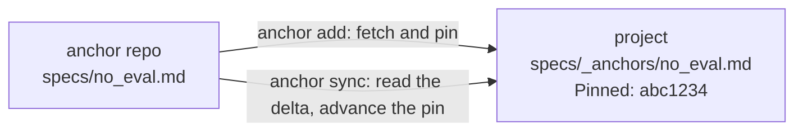

# Specs and anchors

For anyone who writes rules: product, developers and QA.

A spec is one file per feature. It holds the claims the software must satisfy and how each
claim is shown. A **rule** is one claim, one line. A **proof** says in plain language how that
claim is shown. A **test** is any test in your own suite that carries a marker, one comment
naming the proof: `# purlin: login PROOF-2`. Those three are the whole model, and everything
else Purlin does reads them. `references/formats/marker_format.md` is the one home of the
marker.

The format is versioned. `references/formats/spec_format.md` inside the plugin is the
contract, and its `> Format-Version:` line says which version this release ships; this page
explains the format and that file settles it.

## The file

```
specs/<category>/<name>.md
```

```markdown
# Feature: login

> Description: Email and password sign-in with a lockout after repeated failures.
> Requires: security_baseline
> Scope: src/auth.py, src/session.py
> Stack: python/flask, bcrypt

## Rules

- RULE-1: Return 200 and a session cookie for a correct email and password
- RULE-2: Return 401 for a wrong password
- RULE-3: Lock the account for 15 minutes after 5 consecutive failures

## Proof

- PROOF-1 (RULE-1): POST /login with a known user; verify 200 and a Set-Cookie header
- PROOF-2 (RULE-2): POST /login with the wrong password; verify 401 and no cookie
- PROOF-3 (RULE-3): POST /login 5 times with a wrong password, then once with the right one; verify 423
```

You do not type this by hand. `purlin:spec` writes it from a sentence in chat, a ticket, a
requirements document or pasted acceptance criteria, and `purlin:spec <name>` edits it in
place.

`## Rules` and `## Proof` are the only two sections anything reads, spelled exactly so. A spec
carrying some other heading still parses and nothing reads that heading. What the feature does
belongs in `> Description:`.

### Metadata

Every metadata line starts with `>` and every one is optional.

| Field | What it does |
|-------|--------------|
| `> Description:` | Plain-language summary. Continuation lines start with `>`. The dashboard displays it |
| `> Requires:` | Other specs or anchors whose rules are counted with this one's |
| `> Scope:` | The files this feature touches |
| `> Stack:` | Language, framework and the libraries that matter |

`> Scope:` earns its place. The evidence carries a fingerprint of those files, and that hash
is what tells a code change from a rule change. Code changed and the rule, proof and test
text did not: the signature stands and the rule's passed cell reads `out of date` until the
next run clears it. Rule, proof or test text changed: the signature goes stale and a person looks. A
spec with no `> Scope:` cannot make that distinction: `purlin:test` runs its tests every time,
`purlin:status` names it, and at the gate `signed` its rules cannot be signed and no tag is
written.

A path with a trailing slash scopes the directory beneath it, so `> Scope: src/api/` covers
every file under `src/api/` without listing them.

## Rules

One claim per line, in the present tense, saying what the software does rather than how.

```
- RULE-N: <claim> [level: <level>]
```

The one tag sits at the end of the line and is read off it, so the text that remains is the
claim alone. A signature logs the level but does not lock it, so re-marking a rule stales
no signature.

| Tag | Values | Default | What it decides |
|-----|--------|---------|-----------------|
| `[level: ...]` | `passed`, `strong`, `signed` | the project's gate | The evidence the rule must have to meet the gate, in the gate's own words: `passed` asks for passing tests; `strong` for passing tests and an audit that found them sound, which is what turns the AI audit on for that rule; `signed` for both and a person's signature. The gate is the ceiling, so a mark above it is read as the gate |

A level tag is never required: a rule without one takes the project's gate, and at the `passed` gate `purlin:spec` writes none at all, because the gate is the ceiling and every rule is read as `passed` there.

Ids are assigned in increasing order and never reused. A deleted rule leaves its number
vacant and every other rule keeps the number it had; a gap in the sequence is legal and
nothing reports it. Renumbering would silently repoint every test marker and every signature
that already names the old id.

A rule about what the software must never do is an ordinary rule whose proof asserts absence.
There is no separate syntax for it:

```markdown
- RULE-3: No eval() in user-facing code
- PROOF-3 (RULE-3): Grep src/ for eval(); verify zero matches
```

## Proofs

A proof says what a test asserts, not how the test is written. Name the trigger, the input
and the observable that settles the claim.

```
- PROOF-N (RULE-N): <observable assertion>
- PROOF-N (RULE-A, RULE-B): <a flow that exercises several rules in order>
```

Several proofs may name one rule, and one proof may name several rules when it drives a flow
through all of them.

A proof is optional at the gate `passed` and for a rule marked `[level: passed]`: a test may
carry the rule's own id instead, `# purlin: login RULE-2`. A rule with neither a proof nor such a
test reads `no test` with the reason `no proof written`. From `strong` up every rule needs a
proof, and a rule whose tests pass with none reads `no proof` in its strong cell.

### Manual proofs

A proof carries no tag when a test settles it, whatever that test needs to run: `purlin:test`
runs every marked test of the features it runs. Tag a proof `@manual` when only human judgment
settles it.

A `@manual` proof has no test. Its evidence is a signature carrying a one-line note, always
written by a person, never by a machine.

### Operating systems

`@env` says which operating system a proof must be proved on. The values are `windows`,
`macos` and `linux`, and those three are the whole vocabulary.

```
- PROOF-53 (RULE-29): Lock a file and verify a second process cannot open it @env(windows)
```

At most one `@env` per proof. A proof with no `@env` is satisfied by a run on any operating
system. A proof with one is passed only when a run on that system passes it, and a rule with
proofs on two systems needs both. On another machine the run does not count the proof, and the
passed cell reads `not run` with the reason `windows: no run yet`. Where the project has a
remote runner, its matrix gets one job per system the tags name.

## Ids across branches

`purlin:spec` allocates the next free rule and proof id against `origin/main`, not against the
working tree, so two branches cut from the same commit do not both take RULE-9.

When two branches allocated the same number before either fetched, the merge leaves one id
twice. Keep both rules, give the incoming one the next free number, and move its test markers
and its signature filenames with it. Two branches that advanced the same anchor pin resolve to
the newer sha.

## Anchors

An anchor is a spec for something shared across features: a security policy, an API contract,
a data-retention rule. A feature names it with `> Requires: <name>` and the
anchor's rules are counted with the feature's own. An anchor with `> Global: true` applies to
every feature spec without being named.

An anchor uses the same two sections and the same rule and proof grammar as any other spec.

### One repository is the default

Most projects need nothing but `specs/_anchors/`:

```
purlin:anchor create <name>
```

Anyone who writes specs writes anchors there too. Nothing is pinned and nothing is synced. Reach for a second repository only when two or more projects
must share the same rules: it is a cost, and one project does not need it.

### An anchor repo

When several projects share rules, the rules live in their own repository and each project
keeps a pinned copy of the ones it uses.


```mermaid
flowchart LR
  A["anchor repo<br/>specs/no_eval.md"]
  B["project<br/>specs/_anchors/no_eval.md<br/>Pinned: abc1234"]
  A -- "anchor add: fetch and pin" --> B
  A -- "anchor sync: read the delta, advance the pin" --> B
```

**add** fetches the anchor and writes the local copy with two tracking lines the author's own
file does not carry:

```markdown
> Source: https://github.com/acme/policies.git specs/no_eval.md
> Pinned: abc1234def5678
```

A pin is always a commit, never a branch. A branch moves, and an anchor whose rules changed
under a project with no diff to read is exactly what pinning exists to prevent.

**sync** shows the delta, updates the local copy and advances the pin, in one commit:
`security_baseline: RULE-3 changed, RULE-6 added. Pin advanced from abc1234 to 3c4d5e6.` A rule
whose text moved stales its signature. `purlin:anchor sync --check` reports without writing,
and exits 1 when a pin is behind:
`security_baseline: the pin abc1234 is behind its source, now 3c4d5e6. Run purlin:anchor sync security_baseline.`
`purlin:drift` runs the same check, one cached lookup per source per run, so a pin that has
fallen behind shows at the start of a session without anyone asking for it.

Never edit a pinned rule in place: the next sync overwrites it and the change is lost with no
trace. A change to the rule is a pull request against the source repository, and the next sync
brings it back once it merges. A rule that belongs only to this project goes in a separate
local anchor that says `> Requires: <the pinned one>`.

## Next

- A codebase that predates its specs: [spec-from-code.md](spec-from-code.md)
- Who writes which rule: [working-together.md](working-together.md)
