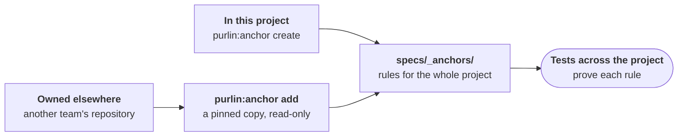

# Specs and anchors

For anyone who writes rules: product, developers and QA.

A spec is one file per feature. It holds what the software must do and how each claim is shown.

## A spec is rules and proofs, one line each

```markdown
# Feature: login

> Description: Email and password sign-in with a lockout after repeated failures.
> Scope: src/auth.py, src/session.py
> Stack: python/flask, bcrypt
> Highest-Rule: 3
> Highest-Proof: 4

## Rules

- RULE-1: Return 200 and a session cookie for a correct email and password
- RULE-2: Return 401 for a wrong password
- RULE-3: Lock the account for 15 minutes after 5 consecutive failures

## Proof

- PROOF-1 (RULE-1): A known user signs in with the right password; the answer is `200` and it sets a session cookie
- PROOF-2 (RULE-2): A known user signs in with a wrong password; the answer is `401` and it sets no cookie
- PROOF-3 (RULE-3): After 5 wrong passwords in a row, the right password is refused with `423`
- PROOF-4 (RULE-3): 15 minutes after the fifth wrong password, the right password is answered with `200`
```

- A **rule** is one claim: what the software must do.
- A **proof** says in plain language how that claim is shown.
- A **test** is any test in your own suite with one comment above it naming the proof,
  `# purlin: login PROOF-2`.

**You do not type this by hand.** Say in your own words what must be true, and `purlin:spec`
writes the rules for you, one line each. It takes a sentence in chat, a ticket, pasted
acceptance criteria or a screenshot. It shows each rule with its proofs, asks whether to
change any, commits the spec and ends on:

```
Spec saved: login. Next: purlin:build login
```

The file lives at `specs/<category>/<name>.md`. Its header lines are optional:

| Line | What it does |
|---|---|
| `> Description:` | A summary in plain language. |
| `> Scope:` | The files this feature's code lives in. When one of them changes, the feature's results read `out of date` until the next run. |
| `> Stack:` | The language, the framework and the libraries that matter. |
| `> Highest-Rule:`, `> Highest-Proof:` | The highest number the spec has ever held. `purlin:spec` keeps them. |

[spec_format.md](../references/formats/spec_format.md) is the format, field by field.

## A good proof names an exact result

- **A rule is one claim per line**, in the present tense. It says what the software does, not
  how.
- **A proof is one sentence a person who cannot read code can judge.** It says what is done,
  what is seen and the exact value: the answer is `401` and it sets no cookie.
- **A rule about what must never happen is an ordinary rule.** Its proof shows the absence:
  every source file is searched for `eval(`, and 0 are found.

[spec_quality_guide.md](../references/spec_quality_guide.md) is the guide to a rule and a proof
worth having.

## Five tags say how, when and where a proof is shown

A test can check a result. A judgment call is checked by hand, or graded by an AI where an AI
produced the thing judged: [graded-by-ai.md](graded-by-ai.md) says how the three differ. A tag
stands at the end of the proof line:

```
- PROOF-5 (RULE-2): Read the error messages against the brand voice guide @manual
```

| Tag | Use it for | What happens |
|---|---|---|
| `@manual` | A judgment call a person must make, like "it looks good" or "it is easy to use". A test cannot decide these. | No test runs for it. `purlin:sign` stops there; a person checks it and writes what they saw. Until then the rule reads `checked at sign-off`. |
| `@slow` | A proof whose tests take a long time, like integration tests and acceptance tests. | `purlin:test` skips it while you build. `purlin:test --all` runs it. When it is due, every status says so: `1 slow proof to run: purlin:test --all` |
| `@env(windows)`, `@env(macos)`, `@env(linux)` | A proof that must be shown on one operating system. | Only a run on that system proves it. Anywhere else the rule reads `not run`, with the reason `Windows: no run yet`. |
| `@ai(<model>)` | A proof about what an AI does with a prompt or a skill. The tag names each model it is shown on. | `purlin:test --all` runs its test 3 times on each model, and every model run must pass. There is one result per model. |
| `@graded(<grader>)` | Beside `@ai`, a proof whose sentence needs judgment a test cannot hold. The tag names the model that grades. | The grader reads each output against the proof's sentence. The rule reads `graded`, never `passed`, and counts as passing. |

One example of each:

```
- PROOF-4 (RULE-2): With the sample report, the reply names the three findings by their ids @ai(claude-opus-5-5)
- PROOF-5 (RULE-3): The summary states no fact the sample report does not hold @ai(claude-opus-5-5) @graded(claude-haiku-4-5-20251001)
```

- **Not everything needs a rule.** Look and feel can stay outside Purlin.
- **A hand check never stops the tests reading `met`.** It is counted as neither passing nor
  failing: `10 rules. 9 pass their tests. 1 is checked at sign-off.`
  [sign-off.md](sign-off.md) shows the stop.
- **Nothing to remember.** The tests are fully `met` only after every slow test has passed.
- **Another system is your project's own run.**
  [running-and-evidence.md](running-and-evidence.md#your-project-runs-the-tests-on-another-system)
  has one worked example.
- **A prompt or a skill is tested like anything else.** [testing-ai.md](testing-ai.md) walks
  an AI proof from rule to evidence, and [graded-by-ai.md](graded-by-ai.md) is grading alone.

## A number never changes

A new rule takes the next number, and a deleted rule leaves its number vacant. Test comments
name the number, so nothing is renumbered.

When two branches take the same number, the one on the default branch keeps it. `purlin:drift`
names the clash, and `purlin:spec` moves the other line to the next free number.
[drift_criteria.md](../references/drift_criteria.md#numbers-written-twice-and-the-default-branch)
gives each step.

## An anchor is a set of rules for the whole project

Tests that run across the whole project prove it. A security policy is one. So is a rule about
what the code must never hold.


```mermaid
flowchart LR
    H["<b>In this project</b><br>purlin:anchor create"] --> A["<b>specs/_anchors/</b><br>rules for the whole project"]
    S["<b>Owned elsewhere</b><br>another team's repository"] --> C["<b>purlin:anchor add</b><br>a pinned copy, read-only"]
    C --> A
    A --> T(["<b>Tests across the project</b><br>prove each rule"])
```

| | |
|---|---|
| They can be in this project | Write a rule once, such as no secret in the code. Tests across the whole project prove it, and no feature names it. |
| They can be owned elsewhere | Security, GRC / GxP, Design, etc. keep their rules in their own repository. Each project brings in the ones it must follow. This kind is a remote anchor. |

An anchor uses the same two sections as any other spec, and its proofs take the same tags.

- **Write each rule as "for every X in the project, Y holds".** In a project with no X the
  test skips with a reason starting `nothing to check:`. The rule reads `passed`, and the
  reason is shown.
- **Any change to the project puts an anchor's results out of date**, until the next run.
- **The audit plants no bug for an anchor's proof.** Its rules read `spot-checked`.
- **A rule that only some features need** goes in those features' own specs.

### An anchor in this project

```
purlin:anchor create <name>
```

It writes `specs/_anchors/<name>.md` and commits it. Most projects need nothing else. Reach
for a second repository only when two or more projects must share the same rules.

### A remote anchor

The team that owns the rules keeps them in its own repository. Your project keeps a copy,
pinned to one commit of its source:

```
purlin:anchor add <url> --path <file>
```

```
security_baseline: written to specs/_anchors/security_baseline.md, pinned 71abd36
  2 rules. Run purlin:status to see them.
```

- **Kept in step.** `purlin:anchor sync` updates your copy and says which rules moved. You
  commit it. The status says when the source has moved on.
- **Read-only.** Your copy is never edited in your project. The next sync overwrites an edit,
  with no trace. A change is made at the source, by the team that owns it.

[anchor_format.md](../references/formats/anchor_format.md) is the format, and
[spec_quality_guide.md](../references/spec_quality_guide.md#a-good-anchor) the checklist for a
good anchor.

## Next

- Running the tests the proofs name: [running-and-evidence.md](running-and-evidence.md)
- Who writes which rule: [working-together.md](working-together.md)
