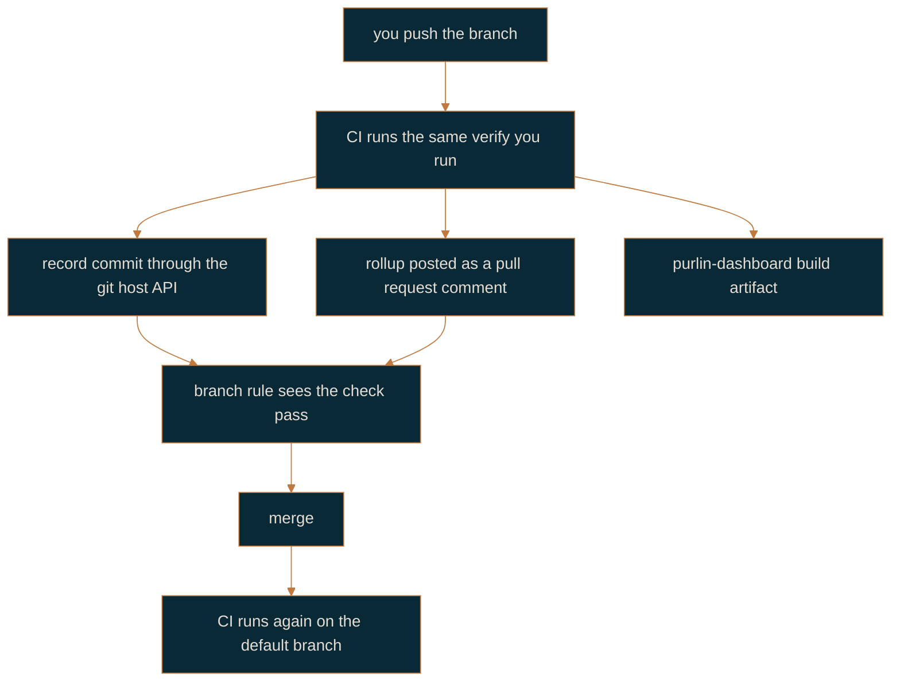

# Team workflow

For a team of a PM, a designer, engineers and QA working at the `recorded` gate.

At `recorded`, a rule counts as proven when CI has written a record for it at the commit
under review and the test strength of that run is at or above `min_strength`. A record a
developer committed no longer counts. That single change is what turns the evidence from
something each person asserts into something the team shares.

If the project is not set up yet, read [getting-started.md](getting-started.md) first. If it
is set up at `tested`, read [raising-the-gate-and-upgrading.md](raising-the-gate-and-upgrading.md).

## What the gate requires

A gate is three things, and all three have to exist:

1. A CI job running `purlin:verify --ci` on every push and every pull request.
2. A branch rule on the default branch that blocks a merge unless that job passes.
3. The setting `gate` in `.purlin/config.json`, here set to `recorded`.

`recorded` derives three defaults, each of which you can change: `min_strength` 70,
`ai_review_at` high, and risk and origin tags optional. Approvals are advisory at this gate:
anyone can write one with `purlin:approve`, and nothing blocks a merge for the want of one.

## CI writes the record that counts

The label on a record comes from the last commit that touched it, never from anything inside
the file. A commit CI made through the git host's API is labelled `ci`; a commit a person made
is `developer`; an uncommitted record is `local`. At `recorded`, only `ci` counts, so a
developer cannot write the evidence their own change is measured by.

Your local `purlin:verify` is still worth running. It is a preflight: it tells you the push
will pass before you spend a CI run finding out. Leave the record uncommitted at this gate,
which is what the skill does when the gate is `recorded`.

CI does not need Purlin installed as a plugin. Purlin's own repository is the plugin, so the
workflow there uses the checkout it already has. A consumer project's runner has no plugin, so
the workflow clones Purlin at the tag the project pins and runs the same verify from that
clone. Set the `PURLIN_REF` repository variable to move that pin without editing the
workflow. Developers load the plugin the other two ways: from the
marketplace, where it sits under `~/.claude/plugins/cache/purlin/purlin/<version>/`, or with
`claude --plugin-dir <checkout>` while working on Purlin itself.

## What every push produces

| Artifact | Where it goes | Who reads it |
|----------|---------------|--------------|
| One record per feature | `.purlin/records/<feature>/` in the tree | the gate, `purlin:status`, the dashboard |
| The seven-state rollup | a comment on the pull request | reviewers, the PM, QA |
| The dashboard | the `purlin-dashboard` build artifact, linked from that comment | anyone with repository access |
| Auto-approvals of low-risk rules | `specs/<category>/<feature>.approvals/` | QA, as work it does not have to do |
| Review briefs | beside the approvals they inform | QA, at the next `purlin:review` |

The comment carries the same rollup `purlin:status` prints in a checkout, so a reviewer with
no clone reads exactly what an engineer reads. [dashboard.md](dashboard.md) describes the
three screens and the filters.

Two cases behave differently, and the job says so in one line rather than failing quietly:

- **A pull request from a fork.** The token is read-only, so verify runs and the comment posts
  and no record is committed. Merge from a branch in the repository when the record matters.
- **A squash merge.** The merge changes the sha, so the record that counts on the default
  branch is the one CI writes after the merge, not the one written on the branch. The
  branch's records fall to the retention rule: the newest three per feature per operating
  system are kept, the rest are pruned as new ones land.

## One sprint, traced

**The PM opens the work.** The PM needs no checkout. With Claude Code on the repository, or
the Purlin PM tool in Claude Desktop, they describe the feature; the tool drafts a spec, tags
its rules `origin: pm`, and opens a pull request. Without an assistant, the PM writes the
criteria anywhere and hands them over; the engineer's agent runs `purlin:spec` and the PM
reviews that pull request instead. Either way the rules land in `specs/` by pull request.

**The designer hands over the mocks.** They export from whatever tool they use, and either drop
the files into `designs/<feature>/` by pull request or upload them to the PM tool, which opens
the pull request for them. `purlin:spec` reads the images and drafts `origin: design` rules
about what a person would see. See [design-in-specs.md](design-in-specs.md).

**The engineer builds.** `purlin:drift eng` at the start of the session says what moved:
files touched and the rules behind them, rules with no test, tags the gate wants, anchor pins
behind their source. Then `purlin:anchor sync` if a pin is behind, `purlin:spec` if a rule is
wrong, `purlin:build`, `purlin:test` while working, `purlin:verify` before pushing. Rules the
engineer adds are tagged `origin: eng`, and the PM sees them in `purlin:drift pm` as derived.

**CI proves it.** The push triggers the workflow. It writes the records, auto-approves the
low-risk rules whose tests pass at or above `min_strength`, writes the briefs for everything
else, posts the rollup and publishes the dashboard.

**QA looks at what is left.** `purlin:review` finds every rule that needs a human look, orders
it by risk, and walks it one brief at a time. At each stop QA approves, adds a case in plain
language, or skips. Adding a case writes a new proof line into the spec and leaves the test
for the next `purlin:build`, which is how QA's judgment reaches the code without QA writing
it. [review-and-approval.md](review-and-approval.md) is the whole of that loop.

**The change merges.** The branch rule is satisfied because the check passed. Nothing about
the merge is special.

## Working at the same time

QA reviewing version N of a rule while an engineer builds N+1 is normal, not a collision. An
approval binds the hashes of the rule text, the proof text and the test body, so the approval
of N stays current on the default branch and the branch that changed the text shows Stale for
exactly what it changed. Records are one file per run with the timestamp, the commit and the
runner in the name, so two runs never write the same path and adding a file never conflicts.
Approvals are one file per rule, so a batch of forty is forty files in one commit and none of
them conflicts either. Proof files are runtime output under `.purlin/runtime/`, which is not
committed, so two people running tests at once cannot disturb each other. The one thing that
does collide is rule numbering: two branches can allocate the same `RULE-N` before either
fetched, and `purlin:spec <name> --resolve` renumbers the incoming one and rewrites its
markers and approval filenames to match.

## When to go further

Raise the gate to `approved` when someone outside the team has to be able to read, from git
alone, who attested to what and when. [regulated-workflow.md](regulated-workflow.md) describes
that gate, and [raising-the-gate-and-upgrading.md](raising-the-gate-and-upgrading.md) describes
the move.

Read next: [review-and-approval.md](review-and-approval.md) for QA's loop,
[running-and-records.md](running-and-records.md) for what verify and CI do in detail,
[working-together.md](working-together.md) for each role's entry point on its own.
