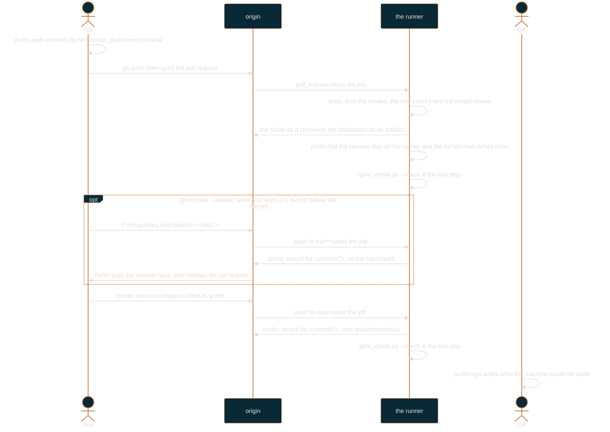

# Team workflow

For a team of a PM, a designer, engineers and QA working at the `strong` gate.

At `strong` a rule carries a second cell. Level 1 asks whether the tagged tests passed; level 2
asks whether those tests are worth trusting, and it is met when a record at the commit under
review has a test strength at or above `min_strength`, no free check found a problem and
nobody holds the rule. Either hand may write that record: your own `purlin:audit` commits one,
and so does CI, and both count at this gate. What the second question adds is the measurement,
not a second machine.

Level 2 is fully automatic. Nobody is asked to do anything to reach it; a person first appears
at the `signed` gate, which [regulated-workflow.md](regulated-workflow.md) describes.

[how-purlin-works.md](how-purlin-works.md) is the model in one page. If the project is not set
up yet, read [getting-started.md](getting-started.md) first. If it is set up at `passed`, read
[raising-the-gate-and-upgrading.md](raising-the-gate-and-upgrading.md).

## What the gate requires

A gate is three things, and all three have to exist:

1. A CI job that decides the merge: on a pull request, on a push to the protected branch, and
   on a push to a `run/*` branch. It runs the tagged tests, then the audit, then writes the
   record. Every run ends with `gate_check.py --check` and fails when the gate is not met.
2. A branch rule on the protected branch that blocks a merge unless that job passes.
3. The setting `gate` in `.purlin/config.json`, here set to `strong`.

`strong` derives three defaults, each of which you can change: `min_strength` 70,
`ai_review_at` high, and risk and origin tags optional. Signatures are advisory at this gate:
nothing blocks a merge for the want of one, and no rule has a signed cell. What a signature
still does here is clear a strong cell reading `manual test`, `manual audit` or `held`, from
anyone, because the signer list is not read below `signed`.

## Where the run happens, and what it writes

```mermaid
%%{init: {"theme": "base", "themeVariables": {"background": "#0C3444", "primaryColor": "#092936", "primaryTextColor": "#E4DDD4", "primaryBorderColor": "#C0793F", "lineColor": "#C0793F", "secondaryColor": "#0C3444", "tertiaryColor": "#092936", "fontFamily": "Arial", "textColor": "#E4DDD4"}}}%%
sequenceDiagram
    actor You
    participant Origin as origin
    participant CI as the runner
    actor QA
    You->>You: purlin:audit commits its record into .purlin/records/local/
    You->>Origin: git push, then open the pull request
    Origin->>CI: pull_request starts the job
    CI->>CI: tests, then the breaks, the free checks and the model review
    CI->>Origin: the rollup as a comment, the dashboard as an artifact
    CI->>CI: prints that the records stay on the runner and the run on main writes them
    CI->>CI: gate_check.py --check is the last step
    opt purlin:test --remote, when you want a ci record before the merge
        You->>Origin: Purlin pushes run/<branch>-<sha7>
        Origin->>CI: push to run/** starts the job
        CI->>Origin: purlin: record for <commit7>, on the run branch
        Origin->>You: Purlin pulls the records back, then deletes the run branch
    end
    You->>Origin: merge, once the required check is green
    Origin->>CI: push to main starts the job
    CI->>Origin: purlin: record for <commit7>, into .purlin/records/ci/
    CI->>CI: gate_check.py --check is the last step
    QA->>QA: purlin:sign walks what the machine could not settle
```

The job starts on three things and nothing else: a pull request, a push to the protected
branch, and a push to a `run/*` branch. A push to any other branch starts nothing, so a feature
branch costs no runner minutes until you open it as a pull request. Where the run happens
decides what it writes. A pull request run does the tests, posts the comment, uploads the
dashboard and commits nothing: a record on a branch nobody merges from is evidence of a branch
that will not exist, and the job says so in one line. A run on the protected branch, or on the
run branch `purlin:test --remote` creates, commits its records and briefs there. Every run
ends with the gate check, which is what makes the required check mean the gate held.

A record's source is the folder it sits in, not a claim inside the file.
`.purlin/records/ci/<feature>/` is CI's, and a branch rule reserves that path and
`.purlin/briefs/ci/**` for the CI identity, so a person cannot push one there.
`.purlin/records/local/<feature>/` is anyone's. A file whose own `source` field disagrees with
its folder is ignored and the run says so in a warning. Both sources count at `strong`; only
`ci` counts at `signed`, which is the one thing the next gate adds to this arithmetic.

`purlin:test` still commits the test results here, and they still count towards the passed
cell. `purlin:audit` is what moves the second one. It prints each feature's test strength
beside the minimum and every finding and observation, writes one record per feature it audited
and the briefs beside them, and commits both itself as `purlin: record for <sha7>`. Its last
line is `gate strong: <n> of <rules>` or `gate not met: <n> of <rules>`, and it exits 1 on the
second. It never pushes: `git push` is yours to type, and if a pre-push hook is installed it
refuses a push made from an agent session outright.

### The remote runner

A remote runner is the git host running your tests for you, and it is worth having for three
reasons and no others:

- **Your tests need another operating system.** Your machine cannot run a test tagged for
  Windows or Linux. The runner can, so those rules stop reading `not run`.
- **Proof from a clean machine.** Your laptop may have uncommitted edits or leftover files.
  The runner runs exactly the code you pushed, on a machine nobody touched. That is what the
  `strong` and `signed` gates trust.
- **No merge while red.** The git host refuses to merge the pull request while a test fails or
  a rule has no test. Nobody has to remember to check.

At `strong` and above `purlin:init` always writes the workflow, and those three reasons are the
explanation of why. `purlin:test --remote` asks for one run of it before the merge, for a proof
tagged `@env` for an operating system your machine is not, or for a `ci` record at this commit.
It is the one push Purlin makes, and it pushes a branch of its own: `run/<branch>-<sha7>`,
created from this commit, watched with `gh run watch`, pulled back with one fast-forward, then
deleted. The branch you are working on never leaves the machine. A detached head and an
uncommitted change are both refused before anything is pushed.

CI does not need Purlin installed as a plugin. Purlin's own repository is the plugin, so the
workflow there uses the checkout it already has. A consumer project's runner has no plugin, so
the workflow clones Purlin at the tag the project pins and runs the same audit from that
clone. Set the `PURLIN_REF` repository variable to move that pin without editing the
workflow. People load the plugin the other two ways: from the marketplace, where it sits under
`~/.claude/plugins/cache/purlin/purlin/<version>/`, or with `claude --plugin-dir <checkout>`
while working on Purlin itself.

## What a run produces, and where it lands

| Artifact | Where it goes | On a pull request run | Who reads it |
|----------|---------------|-----------------------|--------------|
| One record per feature | `.purlin/records/ci/<feature>/` in the tree | written on the runner, not committed | the gate, `purlin:status`, the dashboard |
| One brief per rule the audit reached | `.purlin/briefs/ci/<feature>/` in the tree | written on the runner, not committed | QA, at the next `purlin:sign` |
| The rollup | a comment on the pull request | posted | reviewers, the PM, QA |
| The dashboard | the `purlin-dashboard-<runner>` build artifact, linked from that comment | uploaded | anyone with repository access |
| The gate check | the job log, every line prefixed `gate:` | run, and the job fails when the gate is not met | the branch rule |

CI writes no signature file, ever. The machine's evidence and a person's attestation are written
by different hands, into different paths.

The comment carries the same rollup `purlin:status` prints in a checkout, so a reviewer with
no clone reads exactly what an engineer reads. [dashboard.md](dashboard.md) describes the
three screens and the filters.

Two cases behave differently, and the job says so in one line rather than failing quietly:

- **A pull request from a fork.** The token is read-only, so no commit could be made even on a
  branch that keeps them. The audit runs and the comment posts, and the job says in one line
  that nothing was written.
- **A squash merge.** The merge changes the sha, so the record that counts on the protected
  branch is the one CI writes after the merge, not the one written on the branch. The
  branch's records fall to the retention rule: the newest three per feature per operating
  system are kept, the rest are pruned as new ones land.

## When the tests pass on one operating system and not another

A rule's passed cell keeps one entry per operating system a counting run covered: the word,
the source and when the run happened. The cell reads `partial` when the tests passed on some
of those and failed or did not run on the others. `partial` is not met, so the rule does not
meet the gate, and it has its own tile and its own filter on the board at every gate. A rule
whose proofs are tagged for one operating system alone, with no run there yet, reads `not run`
rather than `partial`: nothing passed, so nothing is partial.

Test strength is not measured per operating system. One number covers the rule, whichever job
measured it, so a matrix of three does not give a rule three strengths to reconcile.

## What the strong cell can read

Level 2 has five answers, and each one names who moves it next.

| Word | What it means | What moves it |
|------|---------------|---------------|
| `strong` | the passed cell is met from a `ci` record, the test strength is at or above `min_strength`, no free check stands against the proof text or the test body, no hold is current, and where the risk asks for a model review there is a brief for the current hashes that observed nothing and settled | nothing; the rule meets the gate |
| `weak` | the passed cell is not met, or the strength is under the minimum, or a free check found something, or the review settled and still observed something the test does not read | build work: `purlin:build` |
| `manual test` | any proof of the rule is tagged `@manual`, so no test can be written for it | a person runs the test and records what they saw with `purlin:sign <feature> RULE-N --note "<text>"` |
| `manual audit` | the rule's risk is at or above `ai_review_at` and there is no brief for the current hashes, or the review did not settle | a person judges the proof against the test, then signs, adds a case or holds |
| `held` | a person committed a hold saying the test does not prove the proof, with the missing case | change the rule, the proof or the test, or sign it for the current hashes, which outranks the hold |

A rule with no break engine for its language reads `strong` with the reason `no engine: free
checks only`, as long as no blocking finding sits on its proof text. An unmeasured rule is
unmeasured, not a failure.

At `strong` the review list holds exactly the rules whose strong cell reads `manual test`,
`manual audit` or `held`. Its header is the one sentence that says so: `<n> rules need a
person`. A `weak` rule is never on it, because a build moves it and no person has to decide
anything. A signature file for the current hashes clears all three words, and at this gate it
counts from anyone: the signer list is not read below `signed`.

## One sprint, traced

**The PM opens the work.** The PM needs no checkout. With Claude Code on the repository, or
the Purlin PM tool in Claude Desktop, they describe the feature; the tool drafts a spec, tags
its rules `origin: pm`, and opens a pull request. Without an assistant, the PM writes the
criteria anywhere and hands them over; the engineer's agent runs `purlin:spec` and the PM
reviews that pull request instead. Either way the rules land in `specs/` by pull request.

**The designer hands over the mocks.** They export from whatever tool they use, and either drop
the files into `designs/<feature>/` by pull request or upload them to the PM tool, which opens
the pull request for them. `purlin:spec` reads the images and drafts `origin: design` rules
about what a person would see. See [design-in-specs.md](design-in-specs.md).

**The engineer builds.** `purlin:drift eng` at the start of the session says what moved:
files touched and the rules behind them, rules with no test, tags the gate wants, anchor pins
behind their source. Then `purlin:anchor sync` if a pin is behind, `purlin:spec` if a rule is
wrong, `purlin:build`, `purlin:test` while working, and `purlin:audit` before pushing, which
is what writes the record the strong cell reads. Rules the engineer adds are tagged
`origin: eng`, and the PM sees them in `purlin:drift pm` as derived.

**CI proves it.** The engineer pushes and opens the pull request; that is what starts the
workflow. It runs the audit: the tests, the breaks, the free checks and the model review where
the risk asks for one. On the pull request it posts the rollup, publishes the dashboard and
runs the gate check, and commits nothing. After the merge it runs again on the protected
branch and commits the records and the briefs there. Every rule it could settle reads `strong`
without anyone being asked.

**QA looks at what is left.** `purlin:sign` finds every rule whose next step is a person, orders
it by risk, and walks it one brief at a time. At this gate that is the rules whose strong cell
reads `manual test`, `manual audit` or `held`: a `@manual` proof, a model review that could not
settle, or a rule someone holds. At each stop QA signs, adds a case in plain
language, holds or skips. Adding a case writes a new proof line into the spec and leaves the
test for the next `purlin:build`,
which is how QA's judgment reaches the code without QA writing it.
[review-and-signing.md](review-and-signing.md) is the whole of that loop.

**The change merges.** The branch rule is satisfied because the check passed, and the check
passed because the last step of the job was the gate check. A person clicks merge; nothing
merges on its own.

## Working at the same time

QA reading version N of a rule while an engineer builds N+1 is normal, not a collision. A
signature binds the hashes of the rule text, the proof text and the test body, so the signature
of N stays current on the default branch and the branch that changed the text reads `stale` for
exactly what it changed. Records are one file per run with the timestamp, the commit and the
runner in the name, so two runs never write the same path and adding a file never conflicts.
Briefs are one file per rule per set of hashes, and signatures are one file per rule, so a batch
of forty is forty files in one commit and none of them conflicts either. Proof files are runtime
output under `.purlin/runtime/`, which is not committed, so two people running tests at once
cannot disturb each other. The one thing that does collide is rule numbering: two branches can
allocate the same `RULE-N` before either fetched, and `purlin:spec <name> --resolve` renumbers
the incoming one and rewrites its markers and signature filenames to match.

## When to go further

Raise the gate to `signed` when someone outside the team has to be able to read, from git
alone, who attested to what and when. [regulated-workflow.md](regulated-workflow.md) describes
that gate, and [raising-the-gate-and-upgrading.md](raising-the-gate-and-upgrading.md) describes
the move.

Read next: [review-and-signing.md](review-and-signing.md) for QA's loop,
[running-and-records.md](running-and-records.md) for what the audit and CI do in detail,
[working-together.md](working-together.md) for each role's entry point on its own.
