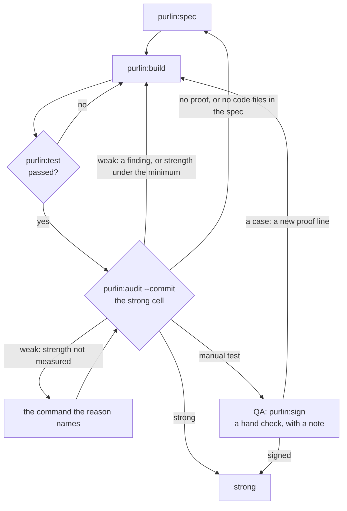

# Team workflow

For a team of product, developers and QA working at the `strong` gate.

At `strong` a rule carries a second cell. The passed cell asks whether the marked tests passed;
the strong cell asks whether the AI audit found those tests sound. It is met when the AI audit
read the rule's current text, proof and test and found nothing, and, where mutation testing is
on, the feature's test strength is at or above `min_strength`. With mutation testing on and no
strength measured, the cell reads `weak` with the reason `strength not measured: <reason>`, and
the reason names the command that fixes it. Your own `purlin:audit` writes what the strong cell
reads, on your own machine, and it counts.

A person appears at this gate for one thing: a proof tagged `@manual`, which no test can settle.
Every other rule reaches `strong` without anyone being asked. The `signed` gate, where every
rule waits on a signature, is [regulated-workflow.md](regulated-workflow.md).

[how-purlin-works.md](how-purlin-works.md) is the model in one page. If the project is not set
up yet, read [getting-started.md](getting-started.md) first. If it is set up at `passed`, read
[raising-the-gate-and-upgrading.md](raising-the-gate-and-upgrading.md).

## What the gate requires

1. The setting `gate` in `.purlin/config.json`, here `strong`.
2. A proof for every rule. A rule whose tests pass and that has no proof reads `no proof`.
3. For every rule, an audit entry in its feature's evidence for the current rule, proof and
   test, which `purlin:audit` writes.

`strong` derives one default you can change: `min_strength` 70, where mutation testing is on.
The AI audit reads each rule that has a proof with a test, whose tests pass, and that has no
audit entry for its current text, proof and test. No rule has a signed cell at this gate. A
signature still clears a strong cell reading `manual test`: `purlin:sign <feature>` signs that
feature's rules waiting for a person, and `purlin:sign --all` signs every one.

## The loop, and what it writes

Each answer sends a rule back to one step or on to the next:


```mermaid
flowchart TD
    Sp["purlin:spec"] --> B["purlin:build"]
    B --> T{"purlin:test<br>passed?"}
    T -->|no| B
    T -->|yes| A{"purlin:audit --commit<br>the strong cell"}
    A -->|"weak: a finding, or strength under the minimum"| B
    A -->|"no proof, or no code files in the spec"| Sp
    A -->|"weak: strength not measured"| M["the command the reason names"]
    M --> A
    A -->|"manual test"| Q["QA: purlin:sign<br>a hand check, with a note"]
    Q -->|"a case: a new proof line"| B
    A -->|strong| G["strong"]
    Q -->|signed| G
```

Every step is on your machine. `purlin:test` and `purlin:audit` write the evidence, `--commit`
on either commits it, and the push is yours to type.

`purlin:audit` runs the tests, then the breaks where mutation testing is on, then the AI audit,
one model call per rule, `audit_parallel` at once (4 by default). It skips a rule whose text,
proof and test match its last audit; `purlin:audit --all` reads them again. It writes what it
found into each feature's `.purlin/evidence/local/<feature>.json`, which `--commit` commits as
`purlin: evidence at <sha7>`. A run over tests that already match their evidence runs none of
them and still reads every rule the audit has not read:

```
Nothing to run: every feature's spec, code and tests match its evidence. purlin:audit --all runs them anyway.

AI audit: 3 rules to read, 3 at a time.

Evidence written to .purlin/evidence/local/login.json.
AI audit: 3 rules read, 3 strong, 0 weak.
```

It ends on the status table, the summary and `Left to do`, as every run does:

```
3 rules. 3 pass their tests. 3 are strong.
Nothing left to do.
```

It exits 1 when a test it ran failed or did not run, or when a rule it read is weak or could
not be audited.

## When a runner joins in

A team at `strong` usually has no remote runner. `purlin:init` writes a runner file for one
reason: a proof is tagged `@env` for an operating system this machine is not. Where one exists,
`purlin:test --remote` pushes this commit to a branch of its own, `run/<branch>-<sha7>`, waits
for the run, pulls back what the runner committed under `.purlin/evidence/ci/`, and deletes the
branch. The branch you are working on stays on your machine.
[running-and-evidence.md](running-and-evidence.md) is the whole of it.

## What the strong cell can read

The strong cell reads one of six words, and each names who moves it next. `weak` has three
causes, each with its own fix.

| Word | What it means | What moves it |
|------|---------------|---------------|
| `strong` | the passed cell is met, the AI audit read the current rule, proof and test and found nothing, and, where mutation testing is on, the strength is at or above `min_strength` | nothing; the rule has reached the gate |
| `weak` | the audit found a gap or could not decide, or the strength is under the minimum: `to strengthen` | `purlin:build`, then `purlin:audit` |
| `weak`, `strength not measured: <reason>` | mutation testing is on and the feature's strength could not be measured, the engine not installed, out of time or writing no report: `to measure` | the command the reason names, then `purlin:audit` |
| `weak`, `strength not measured: the spec names no code files: run purlin:spec <feature>` | mutation testing is on and the spec's `> Scope:` names no code file to break: `to tie to its files` | `purlin:spec` |
| `waiting` | the passed cell is not met, so there is no passing test for the audit to read: `waiting for its tests to pass` | whatever moves the passed cell: a test, a fix or a run |
| `not audited` | no audit has read this rule, proof and test | `purlin:audit`; no person is waiting |
| `no proof` | the tests pass and the rule has no proof | `purlin:spec` |
| `manual test` | a proof of the rule is tagged `@manual`, so no test can be written for it | a person runs the check and signs with `purlin:sign <feature> RULE-N --note "<what you saw>"` |

With mutation testing off, or with an engine that cannot run on this system, a `strong` cell
carries the reason `no mutation score measured`: the audit alone decided it.

A rule whose strong cell reads `manual test` is left to do as `to test by hand`, and
`purlin:sign` walks exactly those rules at this gate. It opens on the line `Left to do` gives
them, such as `1 rule to test by hand: purlin:sign`, or on
`Nothing is waiting for someone to test by hand or to sign.` A counting signature for the
rule's current text, proof and test turns `manual test` into `strong`.

## One sprint, traced

**Product opens the work.** The rules land in `specs/` by pull request, written by product's
assistant or by a developer's `purlin:spec`. [working-together.md](working-together.md) has
each role's way in.

**The developer builds.** `purlin:drift eng` after a pull says what it brought in. Then
`purlin:anchor sync` if a pin is behind, `purlin:spec` if a rule is wrong, `purlin:build`,
`purlin:test` while working, and `purlin:audit --commit` before pushing, which writes what the
strong cell reads.

**The audit proves it.** Every rule whose tests the audit found sound reads `strong` without
anyone being asked.

**QA looks at what is left.** `purlin:sign` walks the rules left `to test by hand`, one rule at
a time, showing the rule, its proofs and what the audit found. At each stop QA answers `sign`,
`case` or `skip`: signs with a line saying what they saw, adds a case in plain language, or
skips. A case is a new proof line in the spec, and the next `purlin:build` writes its test,
which is how QA's judgment reaches the code without QA writing it. The walk closes on what it
did, however much is left:

```
Walked 1 rule: 1 signed, 0 cases added, 0 skipped.
Signed 1 rule as jane@acme.com with the key ending ...YcV4.
Commits: bc0f607
```

The tag `signed/<version>` and the evidence package it carries belong to the gate `signed`,
[regulated-workflow.md](regulated-workflow.md). [review-and-signing.md](review-and-signing.md)
is the whole of that loop.

**The change lands.** A person pushes it.

## Working at the same time

QA reading version N of a rule while a developer builds N+1 is normal. A signature is made over
the rule, its proof, its test, the code the feature's `> Scope:` lists, what the audit found and
the machine the tests ran on, so the signature of N stays current on the default branch, and on
the branch that changed the text the rule reads `unsigned` and is left to do as `to sign`.
Signatures are one file per rule, signer and set of hashes, so a batch of forty is forty files
in one commit and none of them conflicts. The reports a run reads are under
`.purlin/runtime/`, which git ignores, so two people running tests at once do not disturb each
other.

Two things can collide. Evidence is one file per feature per source, so two branches that both
commit one feature's evidence conflict on that file. Whoever runs `purlin:test --commit` or
`purlin:audit --commit` commits the evidence, on the branch they are on: it describes that
branch's code. When a merge conflicts in `.purlin/evidence/`, take either side and run
`purlin:test --commit`: the file is written again, keeping each audit result whose rule, proof
and test are unchanged.

And two branches can take the same number before either fetched. When two branches take the
same number, the number already on the default branch keeps it, and the rule or proof from the
branch not yet merged moves to the next free number. A moved rule needs a new audit and a new
signature; its old signature ends and stays on disk. `purlin:drift` after the merge names every
number written twice and which line moves; until it is fixed, every rule of that spec reads
`failed`.

## Releasing a version

Sign a version on a release branch, such as `release/1.2.0`, cut from the default branch once
its specs are done. New specs land on the default branch and wait for the next version; a fix
lands on the release branch and is merged back. The evidence a version is signed on is committed
on its release branch. The tag is refused while the release branch's copy on the host, as this
checkout last fetched it, holds commits the checkout lacks.

## When to go further

Raise the gate to `signed` when someone outside the team has to be able to read, from git alone,
who signed what and when. [regulated-workflow.md](regulated-workflow.md) describes that gate, and
[raising-the-gate-and-upgrading.md](raising-the-gate-and-upgrading.md) describes the move.

Read next: [review-and-signing.md](review-and-signing.md) for QA's loop,
[running-and-evidence.md](running-and-evidence.md) for what the audit does in detail.
