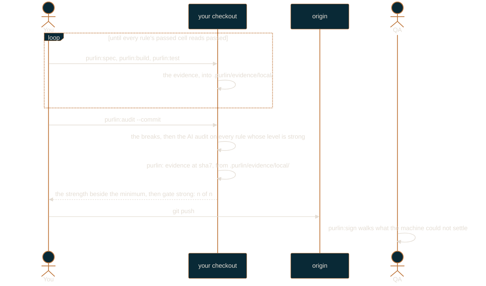

# Team workflow

For a team of a PM, a designer, engineers and QA working at the `strong` gate.

At `strong` a rule carries a second cell. Level 1 asks whether the tagged tests passed; level 2
asks whether those tests are worth trusting, and it is met when a record at the commit under
review has a test strength at or above `min_strength`, the audit observed nothing outstanding
and nobody holds the rule. Your own `purlin:audit` writes that record, on your own machine, and
it counts. What the second question adds is a measurement, not a second machine.

Level 2 is fully automatic. Nobody is asked to do anything to reach it; a person first appears
at the `signed` gate, which [regulated-workflow.md](regulated-workflow.md) describes.

[how-purlin-works.md](how-purlin-works.md) is the model in one page. If the project is not set
up yet, read [getting-started.md](getting-started.md) first. If it is set up at `passed`, read
[raising-the-gate-and-upgrading.md](raising-the-gate-and-upgrading.md).

## What the gate requires

Two things, and nothing on the git host:

1. The setting `gate` in `.purlin/config.json`, here set to `strong`.
2. A record at the commit under review for every rule, which `purlin:audit` writes and `--commit` commits.

`strong` derives two defaults, each of which you can change: `min_strength` 70, and origin
tags optional. Every unmarked rule's level is `strong` here, so the AI audit runs on every
rule that carries no `[level: passed]` tag. Signatures are advisory at this gate and no rule has a
signed cell. What a signature still does here is clear a strong cell reading `manual test`,
`unsettled` or `held`: `purlin:sign <feature>` and `purlin:sign --batch` sign every rule on the
Review list, and a committed signature counts at this gate.

## The loop, and what it writes

```mermaid
%%{init: {"theme": "base", "themeVariables": {"background": "#0C3444", "primaryColor": "#092936", "primaryTextColor": "#E4DDD4", "primaryBorderColor": "#C0793F", "lineColor": "#C0793F", "secondaryColor": "#0C3444", "tertiaryColor": "#092936", "fontFamily": "Arial", "textColor": "#E4DDD4"}}}%%
sequenceDiagram
    actor You
    participant Tree as your checkout
    participant Origin as origin
    actor QA
    loop until every rule's passed cell reads passed
        You->>Tree: purlin:spec, purlin:build, purlin:test
        Tree->>Tree: the evidence, into .purlin/evidence/local/
    end
    You->>Tree: purlin:audit --commit
    Tree->>Tree: the breaks, then the AI audit on every rule whose level is strong
    Tree->>Tree: purlin: evidence at sha7, from .purlin/evidence/local/
    Tree-->>You: the strength beside the minimum, then gate strong: n of n
    You->>Origin: git push
    QA->>QA: purlin:sign walks what the machine could not settle
```

Every step of that is on your machine. `purlin:test` and `purlin:audit` write the evidence,
`--commit` on either commits it, and neither pushes: the push is yours to type. A push is free, and nothing runs when you make one.

`purlin:audit` prints each feature's test strength beside the minimum and everything the audit
observed, and writes it into each feature's `.purlin/evidence/local/<feature>.json`, which
`--commit` commits as `purlin: evidence at <sha7>`. Its last line is `gate strong: <n> of <rules>` or
`gate not met: <n> of <rules>`, and it exits 1 on the second.

An evidence file's source is the folder it sits in, not a claim inside the file.
`.purlin/evidence/local/<feature>.json` is what a run on somebody's machine wrote;
`.purlin/evidence/ci/<feature>.json` is what a remote runner wrote, where the project has one.
A file whose own `source` field disagrees with its folder is ignored and the run says so in a
warning. Both sources count at every gate.

### When a runner joins in

A team at `strong` usually has no CI at all. `purlin:init` writes a workflow for two reasons
and no other: a proof in `specs/` is tagged `@env` for an operating system this machine is not,
so only a runner can prove it, or you chose not to trust this machine for signing, so the tests
a signature rests on run on a clean one. Where one
exists, `purlin:test --remote` asks for a single run of it on a branch of its own,
`run/<branch>-<sha7>`, created from this commit, watched, pulled back with one fast-forward and
then deleted. What comes back is what the runner committed: its own section under
`.purlin/evidence/ci/`, at every gate. The branch you are
working on never leaves the machine.
[running-and-records.md](running-and-records.md#purlintest---remote) is the whole of it.

A runner does not need Purlin installed as a plugin. Purlin's own repository is the plugin, so
the workflow there uses the checkout it already has. A consumer project's runner has no plugin,
so the workflow clones Purlin at the tag the project pins. Set the `PURLIN_REF` repository
variable to move that pin without editing the workflow. People load the plugin the other two
ways: from the marketplace, where it sits under
`~/.claude/plugins/cache/purlin/purlin/<version>/`, or with `claude --plugin-dir <checkout>`
while working on Purlin itself.

## What a run leaves behind

| Artifact | Where it goes | Who reads it |
|----------|---------------|--------------|
| One evidence file per feature, with the tests and the audit | `.purlin/evidence/local/<feature>.json` and `.purlin/tests.md`, committed with `--commit`; a remote run's under `.purlin/evidence/ci/` | a teammate on the git host, the gate, `purlin:status`, the dashboard, QA at the next `purlin:sign` |

A remote runner writes only its own test section under `ci/`, and it writes no signature file,
ever. The machine's evidence and a person's attestation are written by different hands, into
different paths.

The dashboard is the page that opens from disk beside your editor, and a reviewer with no clone
reads `.purlin/tests.md`, the table `purlin:test --commit` commits, on the git host.
[dashboard.md](dashboard.md)
describes the four screens and the filters.

## When the tests pass on one operating system and not another

A rule's passed cell keeps one entry per operating system a counting run covered: the word,
the source and when the run happened. The cell reads `partial` when the tests passed on some
of those and failed or did not run on the others. `partial` is not met, so the rule does not
meet the gate, and it has its own tile and its own filter on the board at every gate. A rule
whose proofs are tagged for one operating system alone, with no run there yet, reads `not run`
rather than `partial`: nothing passed, so nothing is partial.

Test strength is not measured per operating system. One number covers the rule, whichever job
measured it, so a matrix of three does not give a rule three strengths to reconcile.

## What the strong cell can read

Level 2 has six answers, and each one names who moves it next.

| Word | What it means | What moves it |
|------|---------------|---------------|
| `strong` | the passed cell is met, the test strength is at or above `min_strength`, no hold is current, and the AI audit observed nothing and settled | nothing; the rule meets the gate |
| `weak` | the passed cell is not met, or the strength is under the minimum, or the audit settled and still observed something the test does not read | build work: `purlin:build` |
| `not audited` | the rule's level is `strong` or `signed` and no audit has run on this code yet | `purlin:audit`; no person is waiting |
| `unsettled` | the AI audit ran and could not settle whether the test proves the proof | a person judges the proof against the test, then signs, adds a case or holds |
| `manual test` | any proof of the rule is tagged `@manual`, so no test can be written for it | a person runs the test and records what they saw with `purlin:sign <feature> RULE-N --note "<text>"` |
| `held` | a person committed a hold saying the test does not prove the proof, with the missing case | change the rule, the proof or the test, or sign it for the current hashes, which outranks the hold |

A rule with no break engine for its language reads `strong` with a reason saying so. An
unmeasured rule is unmeasured, not a failure.

At `strong` the Review list holds exactly the rules whose strong cell reads `manual test`,
`unsettled` or `held`. Its header is the one sentence that says so: `<n> rules need a
person`. A `weak` rule is never on it, because a build moves it and no person has to decide
anything, and neither is a `not audited` rule: it waits for `purlin:audit`. A signature file
for the current hashes clears all three words, and at this gate any committed signature
counts.

## One sprint, traced

**The PM opens the work.** The PM needs no checkout. With Claude Code on the repository, they
describe the feature; the agent drafts a spec and opens a pull request. Without an assistant,
the PM writes the criteria anywhere and hands them over; the engineer's agent runs
`purlin:spec` and the PM reviews that pull request instead. Either way the rules land in `specs/` by pull request.

**The designer hands over the mocks.** They export from whatever tool they use and hand the
files to `purlin:spec`, which reads the images and drafts rules about what a person would see.

**The engineer builds.** `purlin:drift eng` at the start of the session says what moved:
files touched and the rules behind them, rules with no test, anchor pins behind their
source. Then `purlin:anchor sync` if a pin is behind, `purlin:spec` if a rule is
wrong, `purlin:build`, `purlin:test` while working, and `purlin:audit` before pushing, which
is what writes the record the strong cell reads.

**The audit proves it.** `purlin:audit` runs the tests, the breaks, and the AI audit on every rule
whose level is `strong` or `signed`. It writes one record per feature and one brief per rule it
reached, commits them, and prints the strength beside the minimum. Every rule it could settle reads
`strong` without anyone being asked.

**QA looks at what is left.** `purlin:sign` finds every rule whose next step is a person, the
ones whose level asks the most first, and walks it one brief at a time. At this gate that is the
rules whose strong cell reads `manual test`, `unsettled` or `held`: a `@manual` proof, an AI
audit that could not settle, or a rule someone holds. At each stop QA signs, adds a case in plain
language, holds or skips. Adding a case writes a new proof line into the spec and leaves the
test for the next `purlin:build`,
which is how QA's judgment reaches the code without QA writing it.
[review-and-signing.md](review-and-signing.md) is the whole of that loop.

**The change lands.** A person pushes it, and the push is free: nothing runs at push time and
no hook stands in the way. What says the work is done is the board and the audit's last line,
and at the gate above this one the tag `purlin:sign` writes.

## Working at the same time

QA reading version N of a rule while an engineer builds N+1 is normal, not a collision. A
signature binds the hashes of the rule text, the proof text and the test body, so the signature
of N stays current on the default branch and the branch that changed the text reads `stale` for
exactly what it changed. Records are one file per run with the timestamp, the commit and the
runner in the name, so two runs never write the same path and adding a file never conflicts.
Briefs are one file per rule per set of hashes, and signatures are one file per rule, so a batch
of forty is forty files in one commit and none of them conflicts either. Proof files are runtime
output under `.purlin/runtime/`, which is not committed, so two people running tests at once
cannot disturb each other. The one thing that does collide is rule numbering: two branches can
allocate the same `RULE-N` before either fetched, and then the incoming one takes the next free
number and its markers and signature filenames move with it.

## When to go further

Raise the gate to `signed` when someone outside the team has to be able to read, from git
alone, who attested to what and when. [regulated-workflow.md](regulated-workflow.md) describes
that gate, and [raising-the-gate-and-upgrading.md](raising-the-gate-and-upgrading.md) describes
the move.

Read next: [review-and-signing.md](review-and-signing.md) for QA's loop,
[running-and-records.md](running-and-records.md) for what the audit and CI do in detail,
[working-together.md](working-together.md) for each role's entry point on its own.
