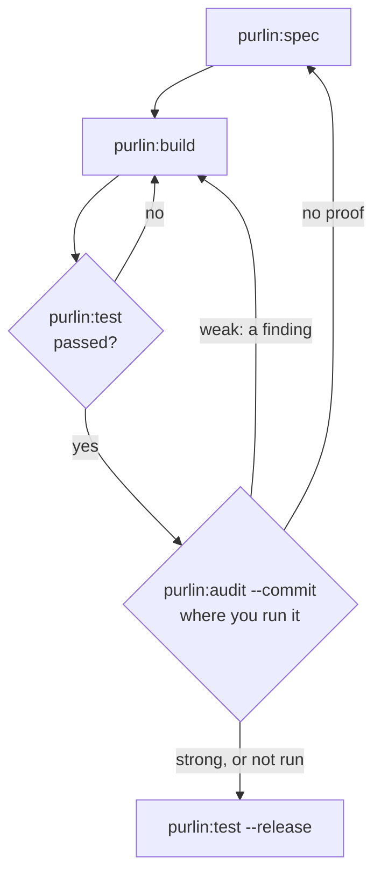

# Team workflow

For a team of product, developers and QA working together, at either gate.

Product, QA and the developers improve rules, proofs and tests together, each on their own
branch. Nothing is signed while the specs change: the status and the dashboard show the state,
and `Left to do` lists only work. A person appears at release time alone, and only at the gate
`signed`: [review-and-signing.md](review-and-signing.md) is that walk.

Every rule carries two cells. The passed cell asks whether its marked tests passed; it is what
the gate reads. The strong cell says what the AI audit found those tests to be, where the audit
ran; nothing waits on it. The audit and mutation testing are tools you run with `purlin:audit`,
at either gate.

[how-purlin-works.md](how-purlin-works.md) is the model in one page. If the project is not set
up yet, read [getting-started.md](getting-started.md) first. To change the gate, read
[raising-the-gate-and-upgrading.md](raising-the-gate-and-upgrading.md).

## The loop, and what it writes

Each answer sends a rule back to one step or on to the next:


```mermaid
flowchart TD
    Sp["purlin:spec"] --> B["purlin:build"]
    B --> T{"purlin:test<br>passed?"}
    T -->|no| B
    T -->|yes| A{"purlin:audit --commit<br>where you run it"}
    A -->|"weak: a finding"| B
    A -->|"no proof"| Sp
    A -->|"strong, or not run"| R["purlin:test --release"]
```

Every step is on your machine. `purlin:test` and `purlin:audit` write the evidence, `--commit`
on either commits it, and the push is yours to type.

`purlin:audit` runs the tests, then the breaks where `mutation_engine` names an engine, then the
AI audit, one model call per rule, `audit_parallel` at once (4 by default). It skips a rule whose
text, proof and test match its last audit; `purlin:audit --all` reads them again. It writes what
it found into each feature's `.purlin/evidence/local/<feature>.json`, which `--commit` commits as
`purlin: evidence at <sha7>`. A run over tests that already match their evidence runs none of
them and still reads every rule the audit has not read:

```
Nothing to run: every feature's spec, code and tests match its evidence. purlin:audit --all runs them anyway.

AI audit: 3 rules to read, 3 at a time.

Evidence written to .purlin/evidence/local/login.json.
AI audit: 3 rules read, 3 strong, 0 weak.
```

It ends on the status table, the summary and `Left to do`, as every run does:

```
3 rules. 3 pass their tests. The audit found 3 strong and 0 weak.
Nothing left to do. To release a version: purlin:test --release
```

It exits 1 when a test it ran failed or did not run, and 0 whatever the audit found.

## When a runner joins in

A team usually has no remote runner. `purlin:init` writes a runner file for one
reason: a proof is tagged `@env` for an operating system this machine is not. Where one exists,
`purlin:test --remote` pushes this commit to a branch of its own, `run/<branch>-<sha7>`, waits
for the run, pulls back what the runner committed under `.purlin/evidence/ci/`, and deletes the
branch. The branch you are working on stays on your machine.
[running-and-evidence.md](running-and-evidence.md) is the whole of it.

## What the strong cell can read

The strong cell reads one of six words. Its word comes from the audit alone; a measured strength
is one of its reasons, as `strength 84%`, and a strength the engine could not measure is
another, as `strength not measured: <why>`.

| Word | What it means | What you can do |
|------|---------------|-----------------|
| `strong` | the AI audit read the current rule, proof and test and found nothing | nothing |
| `weak` | the audit found a gap or could not decide: `to strengthen` | `purlin:build`, then `purlin:audit` |
| `waiting` | the passed cell is not met, so there is no passing test for the audit to read | whatever moves the passed cell: a test, a fix or a run |
| `not audited` | no audit has read this rule, proof and test | `purlin:audit`, when you want it read |
| `no proof` | the tests pass and the rule has no proof | `purlin:spec`; at the gate `signed` the rule is left to write a proof for |
| `manual test` | a proof of the rule is tagged `@manual`, so no test can be written for it | at the gate `signed`, a person checks it in the sign-off walk and types what they saw |

A weak rule is listed as `to strengthen` and never stops a release. The sentence and the
dashboard's `Strong` column name what the audit found only where it read a rule.

## One sprint, traced

**Product opens the work.** The rules land in `specs/` by pull request, written by product's
assistant or by a developer's `purlin:spec`. [working-together.md](working-together.md) has
each role's way in.

**The developer builds.** `purlin:drift eng` after a pull says what it brought in. Then
`purlin:anchor sync` if a pin is behind, `purlin:spec` if a rule is wrong, `purlin:build`, and
`purlin:test` while working, with `--commit` before pushing.

**The audit reads it, where you run it.** `purlin:audit --commit` writes what the strong cell
reads. A weak rule is left to do as `to strengthen`: `purlin:build` adds the case the finding
names.

**QA improves the proofs.** `purlin:drift qa` after a pull names the proofs added, changed and
moved. QA writes a missing case as a new proof line with `purlin:spec`, and the next
`purlin:build` writes its test, which is how QA's judgment reaches the code without QA writing
it.

**The change lands.** A person pushes it.

## Working at the same time

QA reading version N of a rule while a developer builds N+1 is normal: nothing is signed
until the release, so neither waits on the other. The reports a run reads are under
`.purlin/runtime/`, which git ignores, so two people running tests at once do not disturb each
other.

Two things can collide. Evidence is one file per feature per source, so two branches that both
commit one feature's evidence conflict on that file. Whoever runs `purlin:test --commit` or
`purlin:audit --commit` commits the evidence, on the branch they are on: it describes that
branch's code. When a merge conflicts in `.purlin/evidence/`, take either side and run
`purlin:test --commit`: the file is written again, keeping each audit result whose rule, proof
and test are unchanged.

And two branches can take the same number before either fetched. When two branches take the
same number, the number already on the default branch keeps it, and the rule or proof from the
branch not yet merged moves to the next free number. A moved rule's audit is read again.
`purlin:drift` after the merge names every number written twice and which line moves; until it is
fixed, every rule of that spec reads `failed`. `purlin:spec` shows a dry run of the renumbering,
the spec lines and the test comments in this checkout that would change, and asks
`Do it? [y/N]`. Comments on another branch are named, never touched.

## Releasing a version

Release a version on a release branch, such as `release/1.2.0`, cut from the default branch once
its specs are done. New specs land on the default branch and wait for the next version; a fix
lands on the release branch and is merged back. Evidence may be committed on any branch; a
release uses only the evidence at the release commit.

```
purlin:test --release
```

The release run runs every test, commits the evidence and the evidence package
`.purlin/evidence/package/<version>.json`, and at the gate `passed` tags that commit
`passed/<version>`, unsigned. It is refused while a rule's tests do not pass, while the working
tree holds uncommitted changes, and while the release branch's copy on the host, as this checkout
last fetched it, holds commits the checkout lacks. You push the tag.

## When to go further

Raise the gate to `signed` when someone outside the team has to be able to read, from git alone,
who signed each release and what they were shown. [regulated-workflow.md](regulated-workflow.md)
describes that gate, and [raising-the-gate-and-upgrading.md](raising-the-gate-and-upgrading.md)
describes the move.

Read next: [review-and-signing.md](review-and-signing.md) for the release run and the sign-off,
[running-and-evidence.md](running-and-evidence.md) for what the audit does in detail.
