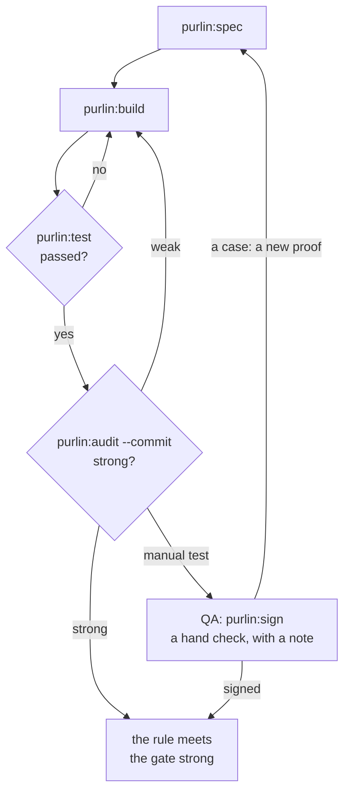

# Team workflow

For a team of product, developers and QA working at the `strong` gate.

At `strong` a rule carries a second cell. Level 1 asks whether the marked tests passed; level 2
asks whether those tests are worth trusting. It is met when the AI audit read the rule's current
text, proof and test and found nothing, and, where mutation testing is on, the test strength is
at or above `min_strength`. Your own `purlin:audit` writes that, on your own machine, and it
counts.

A person appears at this gate for one thing: a proof tagged `@manual`, which no test can settle.
Every other rule reaches `strong` without anyone being asked. The `signed` gate, where every
rule waits on a signature, is [regulated-workflow.md](regulated-workflow.md).

[how-purlin-works.md](how-purlin-works.md) is the model in one page. If the project is not set
up yet, read [getting-started.md](getting-started.md) first. If it is set up at `passed`, read
[raising-the-gate-and-upgrading.md](raising-the-gate-and-upgrading.md).

## What the gate requires

1. The setting `gate` in `.purlin/config.json`, here `strong`.
2. For every rule whose level is `strong`, an audit entry in its feature's evidence for the
   current rule, proof and test, which `purlin:audit` writes.
3. A proof for every such rule. A rule whose tests pass and that has no proof reads `no proof`.

`strong` derives one default you can change: `min_strength` 70, where mutation testing is on.
Every unmarked rule's level is `strong`, so the AI audit reads every rule that carries no
`[level: passed]` tag. No rule has a signed cell at this gate. A signature still clears a strong
cell reading `manual test`: `purlin:sign <feature>` signs that feature's rows in the queue, and
`purlin:sign --batch` signs every row.

## The loop, and what it writes

Each answer sends a rule back to one step or on to the next:

```mermaid
flowchart TD
    Sp["purlin:spec"] --> B["purlin:build"]
    B --> T{"purlin:test<br>passed?"}
    T -->|no| B
    T -->|yes| A{"purlin:audit --commit<br>strong?"}
    A -->|weak| B
    A -->|"manual test"| Q["QA: purlin:sign<br>a hand check, with a note"]
    Q -->|"a case: a new proof"| Sp
    A -->|strong| G["the rule meets<br>the gate strong"]
    Q -->|signed| G
```

Every step is on your machine. `purlin:test` and `purlin:audit` write the evidence, `--commit`
on either commits it, and the push is yours to type.

`purlin:audit` runs the tests, then the breaks where mutation testing is on, then the AI audit,
one rule at a time and `audit_parallel` at once (4 by default). Before the first model call it
prints `AI audit: <n> rules to read, <k> at a time.` It skips a rule whose text, proof and test
match its last audit; `purlin:audit --all` reads them again. It writes what it found into each
feature's `.purlin/evidence/local/<feature>.json`, which `--commit` commits as
`purlin: evidence at <sha7>`, and prints the status table, then `AI audit: <n> rules read,
<n> strong, <n> weak.` and the test strength: `Test strength: <feature> <n>%, ... (minimum
70%).`, or `Test strength: not measured; mutation testing is off.` It ends on
`Audit: <n> strong, <n> weak.` and `gate strong met: <n> of <rules> rules` or `gate strong not
met: <n> of <rules> rules meet it`, and it exits 1 when a rule is short of its tests or its audit.

## When a runner joins in

A team at `strong` usually has no CI at all. `purlin:init` writes a workflow for two reasons
only: a proof is tagged `@env` for an operating system this machine is not, or you chose not to
trust this machine for signing. Where one exists, `purlin:test --remote` pushes this commit to a
branch of its own, `run/<branch>-<sha7>`, waits for the run, pulls back what the runner
committed under `.purlin/evidence/ci/` with one fast-forward, and deletes the branch. The branch
you are working on stays on your machine. [running-and-evidence.md](running-and-evidence.md) is
the whole of it, including how the runner finds Purlin.

## What the strong cell can read

Level 2 has five words, and each one names who moves it next.

| Word | What it means | What moves it |
|------|---------------|---------------|
| `strong` | the passed cell is met, the AI audit read the current rule, proof and test and found nothing, and, where mutation testing is on, the strength is at or above `min_strength` | nothing; the rule meets the gate |
| `weak` | the passed cell is not met, the audit found a gap or could not decide, or the strength is under the minimum | build work: `purlin:build` |
| `not audited` | no audit has run on this code yet | `purlin:audit`; no person is waiting |
| `no proof` | the tests pass and the rule has no proof | `purlin:spec` |
| `manual test` | a proof of the rule is tagged `@manual`, so no test can be written for it | a person runs the check and signs with `purlin:sign <feature> RULE-N --note "<what you saw>"` |

With mutation testing off, or where nothing measured a score, a `strong` cell carries the reason
`no mutation score measured`: the audit alone decided it.

At `strong` the queue holds exactly the rules whose level is `strong` and whose strong cell
reads `manual test`, each a `hand check` row. Its header says so: `<n> rules need a person`. A
`weak` rule is never in it, because a build moves it, and neither is a `not audited` rule: it
waits for `purlin:audit`. A committed signature for the current hashes turns `manual test` into
`strong`.

## One sprint, traced

**Product opens the work.** The rules land in `specs/` by pull request, written by product's
assistant or by a developer's `purlin:spec`. [working-together.md](working-together.md) has
each role's way in.

**The developer builds.** `purlin:drift eng` after a pull says what it brought in. Then
`purlin:anchor sync` if a pin is behind, `purlin:spec` if a rule is wrong, `purlin:build`,
`purlin:test` while working, and `purlin:audit --commit` before pushing, which writes what the
strong cell reads.

**The audit proves it.** Every rule whose tests the audit found sound reads `strong` without
anyone being asked.

**QA looks at what is left.** `purlin:sign` walks the queue one rule at a time: at this gate,
the rules with a `@manual` proof. At each stop QA answers `sign`, `case` or `skip`: signs with a
note saying what they saw, adds a case in plain language, or skips. A case is a new proof line in
the spec, and the next `purlin:build` writes its test, which is how QA's judgment reaches the
code without QA writing it. When the queue is empty and every rule meets the gate, the walk
closes on what it did: `Walked <n> rules: ...` and the commits it made. The tag
`signed/<version>` and the evidence package it carries belong to the gate `signed`,
[regulated-workflow.md](regulated-workflow.md). [review-and-signing.md](review-and-signing.md)
is the whole of that loop.

**The change lands.** A person pushes it.

## Working at the same time

QA reading version N of a rule while a developer builds N+1 is normal. A signature binds the
hashes of the rule text, the proof text and the test body, so the signature of N stays current on
the default branch, and the branch that changed the text reads `stale` for exactly what it
changed. Signatures are one file per rule, signer and set of hashes, so a batch of forty is
forty files in one commit and none of them conflicts. The reports a run reads are under `.purlin/runtime/`, which
git ignores, so two people running tests at once do not disturb each other.

Two things can collide. Evidence is one file per feature per source, so two branches that both
commit one feature's evidence conflict on that file: keep either side and run
`purlin:test --commit` again. And two branches can allocate the same `RULE-N` before either
fetched: the incoming one takes the next free number, and its markers and signature filenames
move with it.

## When to go further

Raise the gate to `signed` when someone outside the team has to be able to read, from git alone,
who signed what and when. [regulated-workflow.md](regulated-workflow.md) describes that gate, and
[raising-the-gate-and-upgrading.md](raising-the-gate-and-upgrading.md) describes the move.

Read next: [review-and-signing.md](review-and-signing.md) for QA's loop,
[running-and-evidence.md](running-and-evidence.md) for what the audit does in detail.
