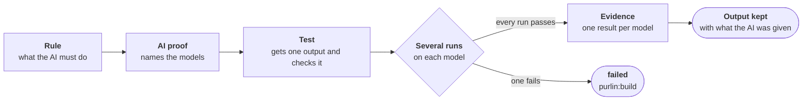

# Testing a prompt or a skill

For a team whose product is a prompt, a skill, an agent definition or a Claude project's
instructions.

A test can read what a skill says. Only a run on a model shows what the skill makes an AI do.
Purlin tests that with an AI proof.



## An AI proof is a proof like any other

It is one sentence with one ordinary test. Its tag, `@ai(...)`, names the models it is shown
on:

```
- RULE-2: The triage prompt's reply names every finding of the report by its id
- PROOF-4 (RULE-2): With the sample report of three findings, the reply names `F-101`, `F-102` and `F-103` and no other id @ai(claude-opus-5-5)
```

- **The proof names a sample input and the exact thing to check in the output.**
- **A person names the model, in the tag.** No setting names one. A proof says nothing about a
  model it does not name.
- **Several models are one tag**: `@ai(claude-opus-5-5, claude-sonnet-5-5)`.

[The table of tags](specs-and-anchors.md#five-tags-say-how-when-and-where-a-proof-is-shown)
has the syntax.

## A sentence about an AI is checked one of three ways

| Check | Tag | Who decides | Example |
|---|---|---|---|
| Exact | `@ai(<model>)` | The test, which looks for a value in the output | `With the sample report, the reply names the three findings by their ids @ai(claude-opus-5-5)` |
| Graded | `@ai(<model>) @graded(<grader>)` | A second model, which reads the output against the proof's sentence | `Asked for a refund over the limit, the reply refuses and blames nobody @ai(claude-opus-5-5) @graded(claude-haiku-4-5-20251001)` |
| By hand | `@manual` | A person, in the sign-off walk | `Read the reply to a refund over the limit against the brand voice guide @manual` |

- **Choose exact** wherever the proof can name the thing to look for: an id, a phrase, a file
  written, a line that must be absent.
- **Choose graded** where the sentence needs judgment a test cannot hold, and an AI's opinion
  is enough. [Graded by an AI](graded-by-ai.md) is the page on it.
- **Choose by hand** where a person must look.

One rule may take an exact proof and a graded one.

## The test gets the AI's output from one helper

The test starts one program, the helper, and checks the folder it prints.

| What you test | The test starts | What happens |
|---|---|---|
| A skill or a plugin | `run --skill <folder>` or `run --plugin <folder>` | A real Claude Code session with that one skill or plugin, in a copy of a sample project |
| A prompt, or a Claude project's instructions | `run --instructions <file>` | One call with those files as the system prompt, and no tools |
| An output your project makes its own way | `record --from <folder>` | Your test asks the model with its own key, then hands the output over |

```python
# purlin: triage_prompt PROOF-4
@needs_the_helper
def test_the_reply_names_the_three_findings_and_no_other():
    folder = output('run', '--instructions', 'prompts/triage.md',
                    '--input', 'tests/samples/report.md')
    assert sorted(set(re.findall(r'F-\d+', reply(folder)))) == [
        'F-101', 'F-102', 'F-103']
```

The test reads the helper's path from the variable `PURLIN_AI`, and skips where it is not set.
[rule_examples.md](../references/rule_examples.md#ai-proofs) has four worked tests and the
few lines `output` and `reply` stand for, and
[purlin_commands.md](../references/purlin_commands.md#the-helper) the helper's command line.

## It runs several times, and every model run must pass

An AI does not answer the same way twice. So the test runs 3 times on each model, and the
proof passes on a model only when every model run passed.

| To change how many | Write |
|---|---|
| For one proof | `runs=<n>` in its tag: `@ai(claude-opus-5-5, runs=10)` |
| For the project | `"runs": 5` in `.purlin/config.json` |

**There is one result per model.** `purlin:status <name>` prints each. Here the proof names
two models:

```
    PROOF-4  passed  3 of 3 on claude-opus-5-5  tests/test_report.py::test_names_findings
    PROOF-4  not run  0 of 3 on claude-sonnet-5-5  tests/test_report.py::test_names_findings
```

- The proof passes when it passes on every model it names.
- A model run that failed on any model makes the rule `failed`.
- **A model that cannot be reached is `not run`, never failed.** The run says
  `claude-sonnet-5-5: model not reached. The login expired. Run purlin:test --all.`

[Running the tests](running-and-evidence.md#an-ai-proof-runs-several-times-on-each-model) has
what the evidence holds.

## It runs with `purlin:test --all`

An AI proof is a slow proof. A plain `purlin:test` leaves it out, so building stays quick.
`purlin:test --all` starts it. Until it has passed, every status lists it:

```
Left to do:
  1 slow proof to run: purlin:test --all
```

Where it passed on one model and holds no result on another, the line names the model:
`1 rule to test on claude-sonnet-5-5: purlin:test --all`.

A changed tag ends the results. Name a new model, and the test runs again on every model.

## The output is kept, with what the AI was given

Each model run writes one folder under `.purlin/runtime/ai/`:

| In the folder | What it holds |
|---|---|
| `reply.md` | the last thing the AI said |
| `transcript.jsonl` | what the session did |
| `files/` | each file the session wrote or changed |
| `input/` | what the AI was given: the message, the instructions and the sample project |

The evidence names the folder by a sha256 over its files. The folder stays on the machine
that ran the test. A sign-off is optional; the first one of a version commits the folders
with the evidence package. [The sign-off](sign-off.md#the-walk-names-each-model-and-each-graded-proof)
shows what the signer reads.

## The audit plants a wrong output

For any other proof the audit plants a bug in the code. For an AI proof it changes a copy of
a kept output, so the proof no longer holds, and runs the test on that copy. A test that still
passes makes the rule `weak`.
[The audit](audit.md#for-an-ai-proof-the-audit-plants-a-wrong-output) says what that shows.

## In regulated work, the model is part of what was validated

[Purlin in regulated work](regulated.md#when-the-product-is-a-prompt-or-a-skill) has the
rows this adds to the workflow, to the package and to what your procedures decide.

## Where it stops

- **Three passes of three show the behaviour held three times.** They do not show it always
  holds.
- **A proof passes on the models it names.** It says nothing about any other.
- **A grade is an AI's opinion against one sentence.** It reads `graded` everywhere, never
  `passed`.
- **The audit tests the check.** It does not show the prompt is a good one.
- **A claude.ai project cannot be driven from outside.** Its instructions are tested as a
  system prompt. What claude.ai itself adds to them is not.
- **A session with a skill or a plugin runs with its permission checks off.** It has none of
  your settings or connectors, and 1800 seconds at most. It can write outside its copy of the
  sample, and with `--plugin` that includes your project's own plugin folder.
- **`files/` holds what changed in the copy alone.** A file the session deleted, or wrote
  anywhere else, leaves no trace there.
- **A prompt sent with `--instructions` gets 300 seconds.** On Windows a long system prompt
  rides on the command line, which holds about 32,000 characters.

## Read next

- [graded-by-ai.md](graded-by-ai.md) for a proof a second model grades.
- [specs-and-anchors.md](specs-and-anchors.md) for writing the rule and the proof.
- [spec_quality_guide.md](../references/spec_quality_guide.md#a-proof-about-what-an-ai-does)
  for a good AI proof.
