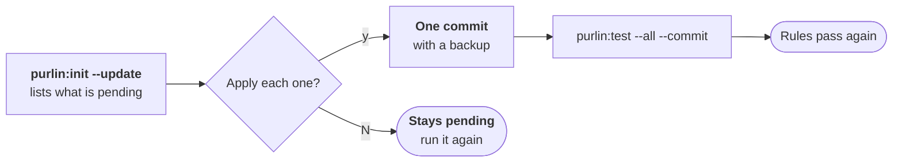

# Upgrading

For the developer who set a project up with Purlin 0.9.5.

```
purlin:init --update
```

Run it once, after the plugin updates. It brings the project's layout to this release.
[RELEASE_NOTES.md](../RELEASE_NOTES.md) says what the release changes.



## Nothing counts until the project is upgraded

`purlin:status` prints only this after its first line:

```
This project was set up by Purlin 0.9.5. Nothing here counts until it is brought to <VERSION>.
→ Run: purlin:init --update
```

A test run stops and writes nothing.

## The update asks before each change

It lists the pending migrations, each with its id, what it does and the files it touches.
Then it asks about each one: `Apply <id>, which will <what it does>? [y/N]`.

`y` applies it. Any other answer leaves it pending, and the others still run. Only the
migrations your project needs are listed.

| Migration | What it changes |
|-----------|-----------------|
| `design-refs` | removes each spec's design reference lines |
| `anchor-lines` | removes `> Requires:`, `> Global:` and `> Scope:` on an anchor: every anchor covers the whole project |
| `os-tags` | rewrites the Windows tag at the end of a proof to `@env(windows)` |
| `kind-tags` | drops the tag naming the kind of test, such as `@unit`; `@manual`, `@slow`, `@env(...)`, `@ai(...)` and `@graded(...)` stay |
| `untracked-files` | deletes the proof and run files 0.9.5 committed and its cache folder |
| `hooks` | deletes the git hooks 0.9.5 installed, and leaves a hook another tool wrote |
| `config` | writes `.purlin/config.json` holding `version` and `tests` alone |
| `evidence` | creates `.purlin/evidence/` with its README |
| `dashboard` | replaces `purlin-report.html` at the project root with the page the plugin ships |
| `workflows` | asks about each workflow under `.github/workflows/` that names a proof file |
| `lettered-proofs` | gives a proof such as `PROOF-7b` the next free number, in the spec and in its tests |
| `markers` | rewrites each 0.9.5 marker as one comment above the same test, `# purlin: <feature> PROOF-<n>`, and removes the lines naming what 0.9.5 used from `CLAUDE.md`, `AGENTS.md` and `.claude/` |
| `plugins` | removes the test plugins 0.9.5 copied into the project and what loaded them |

Under `config` the update proposes a command for each test tool, started the way your project
already starts it:

```
pytest: uv run --project pipeline pytest {files} --junitxml={report}
  package.json, "test:python", runs it as: uv run --project pipeline pytest pipeline/tests
Use this command for pytest? Press Enter to use it, or type the command to use instead:
```

Keep `{files}` and `{report}` in a command you type. A run puts the test files and the
report's path there.

To answer without typing:

| Flag | What it does |
|------|--------------|
| `--yes` | applies every pending migration and uses each proposed test command |
| `--apply <id>[,<id>...]` | applies the migrations named and leaves the others pending |
| `--test-command <tool>=<command>` | writes that command for the test tool; give it once per tool |

`--yes` and `--apply` remove no workflow. Each one that names a proof file is kept and named,
for you to remove by hand.

## Everything applied lands in one commit, with a backup

The update prints one line of totals for each migration, then the commit:

```
  anchor-lines: removed the lines naming anchors from 53 specs
  config: wrote the tests setting: pytest, vitest
  markers: rewrote 533 markers in 95 files
  committed 670def1 as chore(update): migrate to <VERSION> (anchor-lines, config, markers)
```

- Each file a migration rewrote is copied first to `.purlin/runtime/update-backup/`. Each
  change is listed in `update.log` there. Git ignores the folder.
- A file the update deleted is in git, at the commit before the update.
- The `verify:` commits 0.9.5 made stay in git as the earlier record.

Delete the backup folder once the tests pass.

## The update names what it left for you

It ends with three lists. It changes nothing in them.

- `Purlin left these for you:` names each file that still holds text 0.9.5 used. The files
  that instruct an agent come first. Change those first.
- `These need you:` names each line the update could not rewrite, with what to do.
- A test left with its 0.9.5 marker is not counted. Every status and every run names it until
  you rewrite it:

```
2 tests: marker from Purlin 0.9.5. It is not read. For each, write the proof with purlin:spec, put the comment above the test, and take the old tag out.
  tests/test_export.py:12  export RULE-3
  tests/test_lock.py:90  lock RULE-4
```

## Then run every test

```
purlin:test --all --commit
```

The evidence 0.9.5 kept is gone with its files. Every rule reads `not run` until this run:

```
476 rules. 0 pass their tests.
Left to do:
  476 rules to test: purlin:test
```

A test that fails in the full run and passes alone, with `purlin:test <feature>`, is a test of
the project's own. The upgrade did not change it.

The upgrade is done when `purlin:status` prints no `→ Run: purlin:init --update` line and
counts passing rules. From there the loop is the one [getting-started.md](getting-started.md)
walks.

## A project this release set up has nothing to upgrade

The command says so:

```
Nothing is pending: this project is at <VERSION>.
```

Where such a project lacks a file setup writes, `purlin:status` ends with
`→ Run: purlin:init --update`, and the command restores the file. It asks about each one, or
restores all of them with `--yes`, in one commit. It restores four:

| File | What is restored |
|------|------------------|
| `.gitignore` | the lines for `.purlin/runtime/` and `.purlin/report-data.js` |
| `.purlin/config.json` | `version`, where it is not this release; `tests` stays as it is |
| `.purlin/evidence/README.md` | the README, where there is none |
| `purlin-report.html` | the page the plugin ships, where the page at the project root is another |
