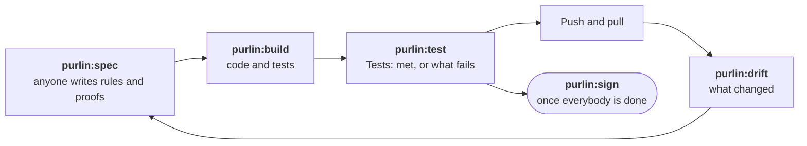

# Working together

For a team where more than one person decides what the software must do: product, developers
and QA.

Product, QA and developers improve the specs together. Everyone works in Claude Code on a
checkout of the repository.



## Purlin has no roles

Whoever knows the answer edits the spec. Every change to a spec is a commit, so git says who
wrote each line. The evidence package carries those names.

## Nothing is signed while the work goes on

Each person works on their own branch. The status and the dashboard show the state, and
`Left to do` lists only work. A person signs once everybody is done.
[sign-off.md](sign-off.md) is that walk.

## Each person has a few commands

| Who | What you do | With |
|---|---|---|
| Product | Describe a feature in plain language: a sentence, a ticket or a list of acceptance criteria. Purlin shows the rules with their proofs and asks before it saves. | `purlin:spec` |
| QA | Write and review the proofs. A proof says in plain language how a rule is shown. The test arrives on the next build. | `purlin:spec` |
| Developer | Build to the rules, run the tests, check the tests would catch a bug. | `purlin:build`, `purlin:test`, `purlin:audit` |
| Whoever signs | Look at each hand check and sign the evidence package. You run no tests. | `purlin:sign` |

Name the command when you change a spec:

```
purlin:spec login: it should also reject an expired token
```

A request typed without the command may not reach it, and the agent may then edit the file by
hand.

Before a sign-off the developer runs and commits every test: `purlin:test --all --commit`.
Anyone may sign, the developer included.

## After every pull, `purlin:drift` says what changed

```
Since your last pull, 0 seconds ago (b9f91d5..1af085f, 2 commits).
2 rules added: export RULE-1; login RULE-4.
1 rule changed: login RULE-2.
```

Run it after you pull, merge, rebase or check out someone else's branch. It has one view, the
same for everyone. It writes nothing and fetches nothing.

It names:

- rules added, changed and removed;
- proofs added, moved, or reworded, with both wordings;
- a test comment whose proof was reworded after the test last changed;
- a rule or proof number two branches both took;
- a remote anchor behind its source.

`--since <N>` reads the last N commits. `--since <YYYY-MM-DD>` reads every commit since that
date. [drift_criteria.md](../references/drift_criteria.md) has every line it prints.

## Three things can collide, and each has one answer

QA reading one version of a rule while a developer builds the next is normal. Two people can
run tests at once without disturbing each other.

| What collides | What you do |
|---|---|
| Two branches both commit one feature's evidence, and the merge conflicts under `.purlin/evidence/` | Take either side, then run `purlin:test --commit`. The file is written again. |
| Two branches took the same rule or proof number | The number already on the default branch keeps it. `purlin:spec` shows the renumbering of the other and asks before it does it. |
| A proof was reworded after its test was last changed | `Left to do` counts a test comment to correct. Run `purlin:build`. |

While a number is written twice, every rule of that spec reads `failed`, and `Left to do`
reads `1 spec to repair: purlin:spec`.

## A remote anchor is changed at its source

Your copy is never edited in your project. A change is a pull request against the repository
that owns the anchor, and `purlin:anchor sync` brings it back once it merges.

## More than one checkout

Each checkout of a repository, a worktree included, has its own results, its own status and
its own dashboard. Nothing is shared until the work is merged. After you merge, run
`purlin:status` in the main checkout to bring its status and dashboard up to date.

## Next

- Writing the rules themselves: [specs-and-anchors.md](specs-and-anchors.md)
- What a run writes and which results count: [running-and-evidence.md](running-and-evidence.md)
- The sign-off: [sign-off.md](sign-off.md)
